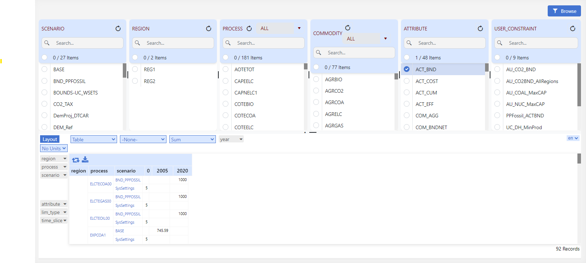
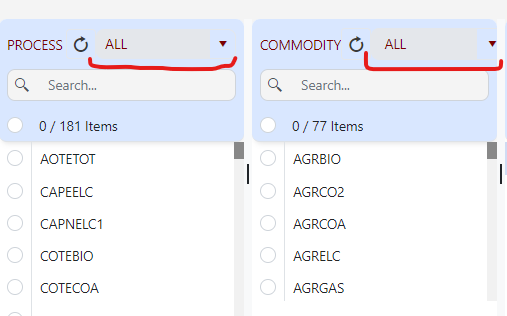

# Browse

## Introduction

!!! note

    All data declarations for Veda models are done in Excel files. To *visualize* the model, use the interface instead of relying on Excel files. Excel should be used for initial and additional data specification. To check declarations or topology for a particular item, use Browse (or Items detail).

Browsing model input is **necessary** for two reasons:

- You may have a syntax error and some of your declarations may have been ignored, or read differently from what you intended.
- The declarations for a single item may be spread across several Excel files, and you will see them all in one place in this interface.
- Browse presents the actual model data.

The Browser thereby enables the user to view subsets of the assembled data in a cube by selecting the scenario(s), region(s), process(es), commodity(ies), and/or the attribute(s) of interest. It is possible to rearrange the layout of the cube by adding/removing dimensions (columns and rows) to/from the table.

## How to use it?

### Load data in Pivot Grid

- Select at least one element from any element list.
- Click **Browse** to load data in the Pivot Grid.

### Filter using sets

- In the Process and Commodity element lists, select **User Set** or **TIMES Set** from the dropdown (as shown below).
- The selected set filters the linked elements.

### Open source Excel from a pivot cell

Use **Excel Viewer** to open the workbook that supplied a number in the Browse pivot.

Double-click a **value** (the number), or select it and press **Enter**. Hover the cell first to see workbook, sheet, and cell in the tooltip.

<figure class="align-center">

</figure>

Do **not** double-click row or column labels such as years or attribute names — those do not open a file. Excel Viewer also does not open when the number is aggregated (several records) or has no file location.

If the tooltip lists a **seed** workbook, both files open (the main file first).

This action is not available in Results or Reports. For GitHub and Save behaviour, see [Excel Viewer](Navigator.md#excel-viewer).
