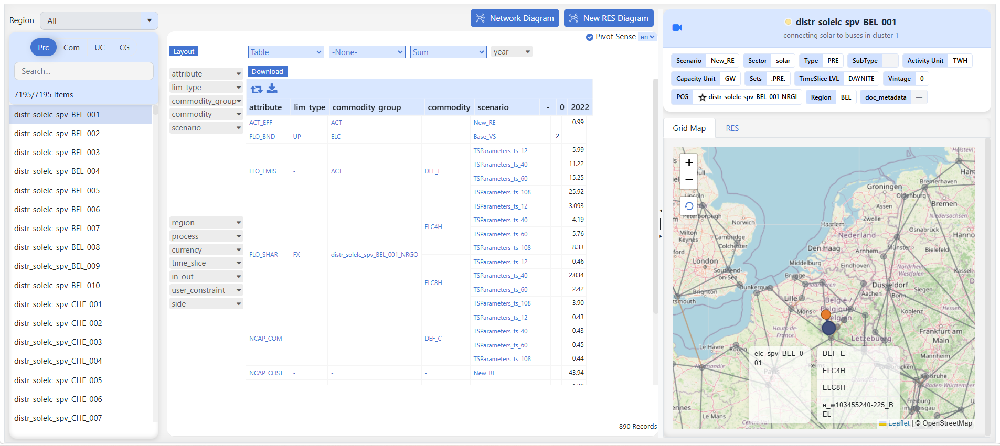
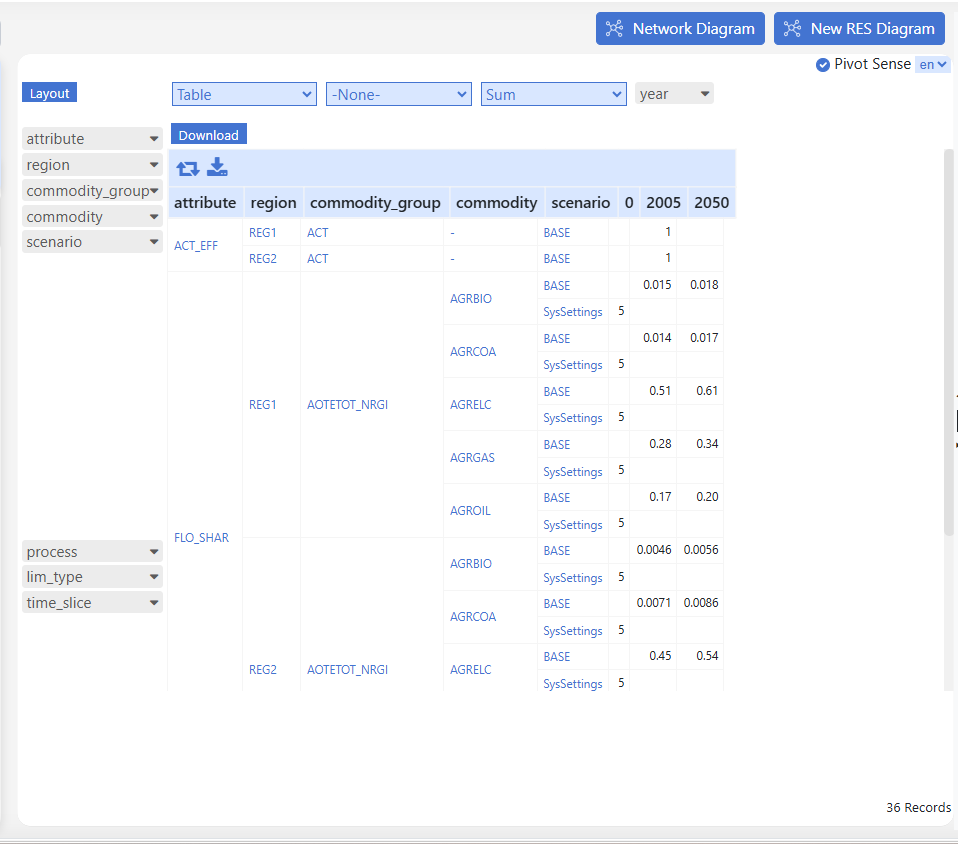
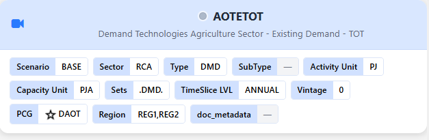
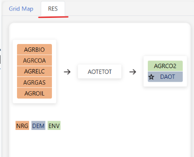

# Items detail

## Introduction

This shows the basic information, topology, and parameters for all items - processes, commodities, user constraints, and commodity groups.

### Basic description of a TIMES process

- A process converts input commodity(ies) to output commodity(ies)
- Each process is linear (e.g. output proportional to input, investment and fixed O&M costs scale with capacity / variable O&M scale with activity)
    - A power plant converts input fuel (e.g., coal/oil/gas/nuclear/renewable source) in electricity
    - A plug-in diesel hybrid car can be modelled as a process that converts electricity and/or diesel to passenger-miles
- A typical national model may have ~1000 processes

## How to use it?

- Select the region from the drop-down list to filter Process, Commodity, UserConstraint, and Commodity Group.
- Select an element from the list to see the data.

### Where to view the data

**Pivot View**  

Pivot View shows the assembled parameters for the selected item in a cube. You can rearrange rows and columns the same way as in [Browse](Browse.md).

When **Excel Viewer** is enabled for your account, you can open the source workbook from a pivot **value** cell (the number):

- Hover the cell first. The tooltip shows workbook, sheet, and cell. If the value also has a **seed** source, the tooltip lists that workbook too.
- Openable value cells use a pointer cursor. Click once to select the cell (blue outline).
- **Double-click** the value cell, or press **Enter** on the selected cell, to open **Excel Viewer** at that sheet and cell.
- If the cell has a seed source, both workbooks open (primary first, then seed).

Excel Viewer does **not** open from:

- Row or column labels (attribute names, years, and other dimension text)
- Aggregated cells (more than one underlying record) — the tooltip already says the location is unavailable
- Cells with no file path or cell address

GitHub save rules are the same as Navigator: if GitHub is ahead, or no token is saved on a linked model, the workbook opens **view only**. See [Excel Viewer](Navigator.md#excel-viewer) and [Push Excel files to GitHub](Navigator.md#push-excel-files-to-github).

**Detailed View**  

!!! note

    Coming soon. Detailed documentation for <strong>Detailed view</strong> will be added here. The image above is a visual reference.

**Basic View**  

!!! note

    Coming soon. Detailed documentation for <strong>Basic view</strong> will be added here. The image above is a visual reference.

**Network Diagram**  

!!! note

    Coming soon. Detailed documentation for <strong>Network Diagram</strong> will be added here. The image above is a visual reference.

**New RES Diagram**  

!!! note

    Coming soon. Detailed documentation for <strong>New RES Diagram</strong> will be added here. The image above is a visual reference.
