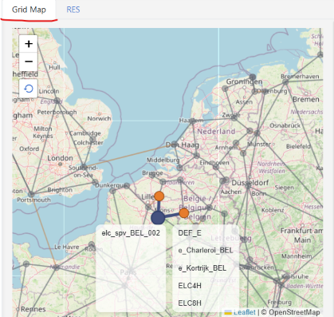

# Items detail

## Introduction

This shows the basic information, topology, and parameters for all items — processes, commodities, user constraints, and commodity groups. When the model includes commodity locations (from a **~commodity_geo** table), you can also open a **Grid Map** of commodities and trade links.

### Basic description of a TIMES process

- A process converts input commodity(ies) to output commodity(ies)
    - Each process is linear (e.g. output proportional to input, investment and fixed O&M costs scale with capacity / variable O&M scale with activity)
    - A power plant converts input fuel (e.g., coal/oil/gas/nuclear/renewable source) in electricity
    - A plug-in diesel hybrid car can be modelled as a process that converts electricity and/or diesel to passenger-miles
- A typical national model may have ~1000 processes

## How to use it?

- Choose a **region** from the drop-down (or **All**).
- Switch the left list with **Prc**, **Com**, **UC**, or **CG**, then search or select an item. The center Pivot, Detailed View, and topology tabs follow that selection.

## Where to view the data

### 1. Network Diagram

#### Introduction

Network Diagram is a separate window that draws the energy system around the **process** or **commodity** you selected. Items sit in columns from left to right — upstream on the left, the selected item in the middle, downstream on the right. Curved paths show how commodities and processes connect. The diagram includes up to **five input and five output levels** automatically.

<figure class="align-center">

</figure>

#### Purpose

Use it for a fast neighborhood scan. Use **New RES Diagram** when you need more hops, filters, or chain highlighting.

#### How to use

1. In the left list, select a **process** or **commodity**.
2. Above the Pivot, click **Network Diagram** (or press **Alt+N+D**). The button is hidden for **User constraint** and **Commodity Group**.

- The selected item is in the **center** column (**red**, **bold**, **underlined**). Process names are **blue**; commodity names are **black**.
- Colors follow TIMES types (legend, top-right). Curved paths are connection bundles — hover a path to isolate it.
- **Hover** an item for type, description, units, and time-slice level. **Click** an item (not the center or **MORE...**) to open it as a tab. Selecting another left-list item adds a tab.
- If a level has more than **25** items, a non-clickable **MORE...** node means the list was truncated. Pick a more specific item, or filter in **New RES Diagram**.

!!! tip

    **Network Diagram** and **New RES Diagram** both show RES topology, but the layout and controls differ. Use **Network Diagram** for a quick bundled view up to five levels on each side. Use **New RES Diagram** when you need **Left / Right** levels (0–10), filters, or chain highlighting by clicking node boxes.

### 2. New RES Diagram

#### Introduction

New RES Diagram is a separate window that shows a Reference Energy System graph for the **process** or **commodity** you selected. Inputs sit on the left, the selected item is in the center, and outputs sit on the right. Boxes use TIMES type colors, with a legend in the bottom-left.

#### Purpose

Use it when one hop is not enough: you can show **0–10** levels on each side, keep only selected sets or names, and walk the network in tabs. Basic View on the **RES** tab stays at one hop.

#### How to use

1. In the left list, select a **process** or **commodity**.
2. Above the Pivot, click **New RES Diagram** (or press **Alt+N+R**). The button is hidden for **User constraint** and **Commodity Group**.

- Inputs are on the **left**, the selected item in the **center**, outputs on the **right**. Colors follow TIMES types (legend, bottom-left).
- Set **Left** / **Right** hops (**0–10**, default **1**) and click **Update**. **0** hides that side.
- Filter with the top bar, then **Update**. Leave a field blank for no filter:

    | Control | What to type |
    | --- | --- |
    | **Process → Set Name** | A process set (User Set or TIMES Set) |
    | **Process → Element** | Names (comma-separated) or a wildcard such as `*GAS*` |
    | **Commodity → Set Name** | A commodity set (User Set or TIMES Set) |
    | **Commodity → Element** | Names (comma-separated) or a wildcard |

- **Click the name** in a box to open that item as a tab. **Click the box** (not the name) to highlight its chain. **Pan** by dragging; **zoom** with the mouse wheel.
- If the graph is truncated, a note reads *The data shown here is not complete*. Narrow **Levels** or the filters, then **Update**.

!!! note

    New RES Diagram is not the same as the **RES** tab. **RES** is Basic View — the selected item and its direct inputs and outputs only. Use **New RES Diagram** when you need more hops, filters, or to walk the network by opening items in tabs.

### 3. Pivot View

#### Introduction

The Pivot is the **center** panel on Items detail. It is an interactive table of **flat-file input data** (parameters and assumptions) for the item selected in the left list — a process, commodity, user constraint, or commodity group.

#### Purpose

Use it to review the parameters actually read for that item, rearrange dimensions, and download the table.

#### How to use

1. Select an item in the left list. The Pivot loads that item’s parameters.
2. Use **Layout** to drag dimensions onto rows, columns, or filters (for example attribute, region, commodity, scenario).

For general pivot controls, see [Pivot Grid](../Pivot-grid.md).

### 4. Detailed View

#### Introduction

Detailed View is the summary card at the top of the **right** panel, above the **Grid Map** and **RES** tabs. It shows the selected item’s name, description, and classification badges from the model sets (type, units, sets, region, and similar fields).

#### Purpose

Use it to confirm the item’s identity and classification. Parameter values stay in the Pivot; this card is metadata only.

#### How to use

Select an item in the left list. The card updates automatically — no extra button or tab.

- The camera icon opens a short [Items View video on YouTube](https://youtu.be/ds4iRFE69Ag).
- **Header** — Item name with a colored dot for **Type** (same colors as the RES diagrams). Description is the line below.
- **Badges** — Label and value pairs (for example **Type**, **Sector**, **Activity Unit**). Empty fields show **—**. Hover a long value for the full text.
- **PCG** — For processes, **Primary Commodity Group** includes a star icon beside the value.

| Item type | Typical fields |
| --- | --- |
| **Process** | Scenario, Sector, Type, SubType, Activity Unit, Capacity Unit, Sets, TimeSlice LVL, Vintage, PCG, Region |
| **Commodity** | Scenario, Type, SubType, Activity Unit, Sets, TSLVL, LimType, PeakTS, Region |
| **User constraint** | Scenario, Region, LimType |
| **Commodity group** | Scenario, Process, Region |

!!! note

    A **doc_metadata** badge appears when the model has documentation metadata. With a single region, values are for that region; with **All**, a badge may list several values if the item differs across regions.

### 5. Grid Map

#### Introduction

**Grid Map** is a tab on the right panel (next to **RES**) that places commodities and trade processes on a geographic map. **Points** are commodities that have a location (latitude and longitude). **Lines** are processes that link two commodities (typically trade): gray for the same region, orange for **cross-border**.

#### Purpose

Use it to see **where** items sit and how they connect. Locations come from a **~commodity_geo** table; without that table (or before **Synchronize**), the map is empty and Items detail stays on **RES**.

#### Setting up ~commodity_geo

Grid Map needs latitude and longitude for commodities. Add them in Excel with the **~commodity_geo** tag.

- **File location**
    Put the table in the model **Trade Links** workbook:

    | | |
    | --- | --- |
    | **Folder** | `SuppXLS/Trades/` (under the model root) |
    | **File name** | `ScenTrade__Trade_Links` |

    This is the same workbook used for trade-link definitions (for example **~TradeLinks**). Add **~commodity_geo** on its own sheet in that file. If the workbook is missing, create it in `SuppXLS/Trades/` with this exact name so Veda classifies it as Trade Links.

- **Structure of ~commodity_geo table**

    | commodity | region | lng | lat |
    | --- | --- | --- | --- |
    | e_AixLesBains_FRA | FRA | 6.418382 | 45.66201 |
    | e_Annecy_FRA | FRA | 5.804484 | 46.05579 |
    | e_Aosta_ITA | ITA | 7.431605 | 45.603 |
    | e_Arlon_BEL | BEL | 5.797338 | 49.56518 |
    | e_Basildon_GBR | GBR | 0.716158 | 51.4405 |
    | e_Bastia_FRA | FRA | 9.449985 | 42.52849 |
    | e_Bayonne_FRA | FRA | -1.43074 | 43.42153 |
    | e_Belfort_FRA | FRA | 6.663611 | 47.36735 |
    | e_Bellinzona_CHE | CHE | 8.83773 | 46.44124 |
    | e_Brescia_ITA | ITA | 9.820005 | 45.67123 |
    | e_Briancon_FRA | FRA | 6.712357 | 45.21485 |

    - **commodity** and **region** are required.
    - **lng** and **lat** are longitude and latitude in decimal degrees.
    - A commodity can appear on more than one row if it has a location in more than one region.

Trade links on the map still come from the usual trade tables in the same file — **~commodity_geo** only supplies coordinates for the points.

 -**See it in Navigator**

1. Open **Navigator** for the model.
2. In the **Trade Scenarios \[TS\]** quadrant (see [Navigator — Trade Scenarios](Navigator.md#trade-scenarios-ts)), find the row **`_Trade_Links`**. That row is the `ScenTrade__Trade_Links` workbook.
3. Check the import checkbox if the file is marked **ToImport** (orange).
4. After **Synchronize**, hover the **`_Trade_Links`** row to see imported tags; **commodity_geo** appears in the tooltip with its row count.
5. File status follows the usual Navigator legend (**Consistent**, **Inconsistent**, and so on).

#### How to use

Open the **Grid Map** tab (below Detailed View). If the model has no **~commodity_geo** data, the map is empty and Items detail stays on **RES**.

- **Pan and zoom** as on a normal map. **Hover** a point for commodity and region; **hover** a line for the process, the two commodities, and whether it is cross-border.
- **Click a point** to select that commodity in the left list. Use **reset** (restore icon, top-left) to return to the full linked network.
- Keep the tab open and change the left-list selection:
    - **Commodity with trade links** — The selection is highlighted; linked processes and opposite commodities are emphasized; the rest is dimmed.
    - **Commodity with no links** — If it has a location, it appears as a larger marker; other points stay dimmed.
    - **Process** — Inputs and outputs that have map locations are shown. Lists at the bottom show inputs (left) and outputs (right); click a name to select it.
    - **User constraint** or **commodity group** — The map returns to the default linked network.

By default the map shows only commodities that already have a trade link. Unlinked locations appear when you select them.

!!! note

    If the model has no **~commodity_geo** table (or it has not been synchronized), there is nothing to plot. You can still open **Grid Map**; the map stays empty until locations are in `ScenTrade__Trade_Links` and the model has been synchronized. Trade links still come from the usual trade tables — **~commodity_geo** only supplies coordinates for the points.

### 6. Basic View (**RES**)

#### Introduction

Basic View is the **RES** tab in the lower-right panel (below Detailed View, next to **Grid Map**). It is a one-hop Reference Energy System for the item in the left list: the selected item in the center, **direct** inputs on the left, **direct** outputs on the right.

#### Purpose

Use it to see what connects to one process, commodity, user constraint, or commodity group **without** opening a diagram window. For more hops, use **Network Diagram** or **New RES Diagram**.

#### How to use

1. Select an item in the left list.
2. Open the **RES** tab if **Grid Map** is showing. The panel updates automatically.

- Flow is left to right. Colors follow TIMES types (legend under the lists). **Hover** a name for its description.
- **Click a name** to select it in the left list (Pivot, Detailed View, and Basic View follow). Clicking an input or output switches dimension (commodity ↔ process). Clicking a **user constraint** switches the left list to **UC**.
- Empty extra lists are hidden when the model has no data for them.

| Position | What it lists |
| --- | --- |
| **Left** | Direct inputs — commodities into a process, or processes that **produce** the selected commodity |
| **Right** | Direct outputs — commodities out of a process, or processes that **consume** the selected commodity |
| **Above** the center | **Auxiliary outputs** |
| **Below** the center | **Auxiliary inputs** |
| **Top-left** | **User constraints** that include this process or commodity |
| **Bottom-left** | **NCAP_ICOM** — consumed when **new capacity** is built |
| **Top-right** | **NCAP_OCOM** — produced when **new capacity** is built |

A **star** next to a commodity name marks membership in the process **Primary Commodity Group** (same icon as Detailed View).

The region drop-down filters topology. With a single region, lists are for that region. With **All**, you see the combined neighborhood across regions.

!!! note

    When the left list is on **User constraint** or **Commodity Group**, the arrows become **link** icons. Those modes show membership, not process–commodity flow.
