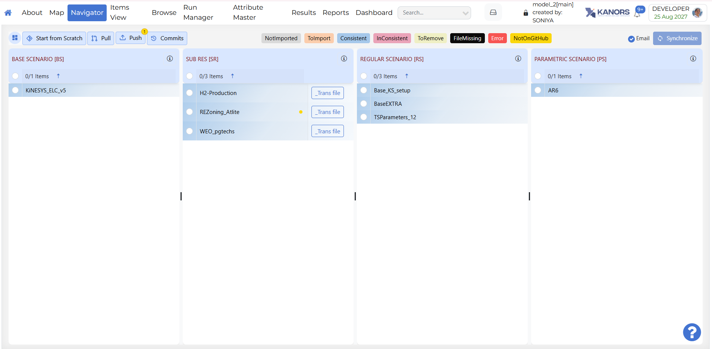
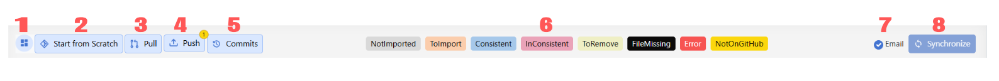
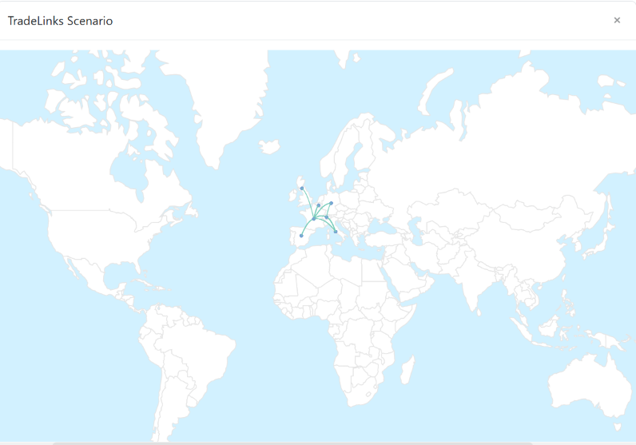

# Navigator

## Introduction

- The Navigator provides a comprehensive view of all the templates in the various folders managed by Veda for the current model.
- The Navigator is the main vehicle for accessing, importing, and coordinating the various templates that make up a model.
- Its main screen is divided into sub-windows according to the various types of templates managed by Veda.

## Quadrants

- **SysSetting**: Used to declare the basic structure of the model, including regions, time slices, start year, and synchronization settings. There is only one such file, and it has a fixed name that stands for System Settings.
- **Base scenario \[BS\]**: Templates used to set up the base-year (B-Y) structure of the model, including existing commodities, current process stock, and base-year end-use demand levels. The B-Y templates are named as `VT_<workbook name>_<sector>_<Version>` (for example, `VT_REG_PRI_V1`). The number and names of these templates depend on the model structure and on how the input data is organized. The B-Y templates are introduced in `DemoS_001`.
    - **BY_Trans**: Transformation files used to update information already included in the B-Y templates or to insert new information for existing processes. They work like scenario files, but their rule-based filters and update or insert changes apply only to processes and commodities that already exist in the B-Y templates. The `BY_Trans` file is introduced in `DemoS_009`.
- **BaseTrans**: Operations on the BS templates.
- **SubRES \[SR\]**: Files used to introduce new commodities and processes in the RES that are not part of the B-Y templates. Unlike B-Y templates, SubRES files are region-independent. Each SubRES file has a corresponding transformation file for adding region-specific process attributes, including availability by region. The naming conventions are `SubRES_<name>` and `SubRES_<name>_Trans`.
- **Regular Scenarios \[RS\]**: Scenario files used to update existing information or insert new information in any part of the RES, including B-Y templates, SubRES files, and Trade files. They are also used to include additional user constraints in the model. The naming convention is `Scen_<scenario name>`. These files can insert or update attributes for previously declared RES components, but they cannot add new commodities or processes. Scenario files are introduced in `DemoS_004`.
- **Demand Scenarios \[DS\]**: Demand templates include the information required to project end-use demands for energy services in each region, such as macroeconomic drivers and sensitivity series. Multiple demand files may be used to model different demand growth scenarios. The naming convention is `ScenDem_<scenario name>`. This section also contains `Dem_Alloc+Series`, which assigns a demand driver and a sensitivity or elasticity series to each end-use demand in each region. Demand files and tables are described in `DemoS_010`.
- **Trade Scenarios \[TS\]**{: #trade-scenarios-ts }: This section contains files where unilateral and bilateral trade links between regions are declared, together with associated data where needed. It also contains all attribute specifications for trade processes. Multiple trade files may be used for different trade scenarios or commodities. The naming convention is `ScenTrade_<scenario name>`. Trade files are introduced in `DemoS_005`. After a sync, [**Model Trade Links**](#model-trade-links) draws those declared links on a world map.
- **Parametric Scenarios \[PS\]**: Functionality designed to support multiple runs and parametric analysis through programmed multi-value scenario sets.
- **No Seed Values \[NSV\]**: Files that do not provide seed values to any other scenario. These are processed in parallel. Veda identifies which files can be converted into NSV scenarios. This feature was introduced in 2019.

!!! note

    - 1 contains comprehensive information about the model. Veda will not synchronize without this file.
    - 2 and 3 are calibration templates for the base year.
    - 5 to 8 are groups of flexible, rule-based scenario files.

## How to use it?

### Toolbar actions

1.  **Options Menu** – Provides access to additional Navigator features:

    - **NoSeedValue Scenario**

        !!! note

            Coming soon. This section will be updated to describe the <strong>NoSeedValue Scenario</strong> in Veda Online.

    - **Tag Details**

        !!! note

            Coming soon. This section will be updated to describe <strong>Tag Details</strong> in Veda Online.

    - **Model Trade Links** — Opens a world map of inter-regional trade links from your **Trade Scenarios** files. See the [section below](#model-trade-links) for how to open and use the map.

    - **Sync Logs**

        !!! note

            Coming soon. This section will be updated to describe <strong>Sync Logs</strong> in Veda Online.

    - **Delete Logs**

        !!! note

            Coming soon. This section will be updated to describe <strong>Delete Logs</strong> in Veda Online.

2.  **Start from Scratch** – Deletes the previous model data from the database and pulls all files from the GitHub repository. You then need to synchronize the model again. Reports module data is not deleted.
3.  **Pull** – Pulls all files from the Git repository without changing your data in the VedaOnline database.
4.  **Commits** – Lets you review your GitHub commits directly in VedaOnline.
5.  **File Status** – Provides feedback about the status of the various files and the integrated database managed by Veda, according to the color legend at the bottom of the form.
    - **Not imported** – not yet read into the database
    - **Imported** – selected for importing with the next SYNC
    - **Consistent** – template is in sync with the database
    - **Inconsistent** – file has been modified after the last SYNC operation
    - **ToRemove** – previously imported template now flagged for removal from the database
    - **FileMissing** – a previously imported template that no longer exists in the template folder
    - **Error** – the file has thrown an error
6.  **Email Checkbox** – If this checkbox is cleared, VedaOnline will not send an email after synchronization finishes.
7.  **Synchronize** – Processes all templates in the application folder that are marked in the selected files list as `ToImport` (orange).
    - Synchronize imports all selected Excel workbooks into the Veda database. Processing can be observed live in the right-hand logging window or on the **Jobs Dashboard** page.
    - An email is sent to the associated user upon completion. Whether the run succeeds or fails, the sync log details are included in the completion email.
    - After synchronizing a model, you can return to the Navigator.

### Model Trade Links {: #model-trade-links }

**Model Trade Links** is a world map of **inter-regional trade** in the current model. Each arc is a declared link between two regions from your **Trade Scenarios** files (`ScenTrade_<scenario name>`). Use it after a **Synchronize** to check that trade is set up between the regions you expect.

**Open the map**

You can open the same window in two ways:

1. On the Navigator toolbar, open the **Options** menu and choose **Model Trade Links**.
2. On the **Trade Scenarios \[TS\]** grid, click the **earth** icon in the grid header (tooltip: **Scenario Trade links**).

**How to read the map**

- The background is a world map of countries.
- A **teal curved line** is one trade link, drawn between the two regions named in that link.
- A small **blue marker** moves along the line to show the direction of the link (from the first region toward the second).
- Region positions come from Veda’s built-in list of region coordinates, matched to the **region names** in the model. You do not enter latitude or longitude in Excel for this map.

**Explore the map**

- **Pan** by dragging. **Zoom** with the mouse wheel.
- **Hover a line** to see the two regions in a tooltip (`Region1 → Region2`). Links that do not start from the same origin region are dimmed so the hovered route is easier to follow.
- Move the pointer off the line to show all links again.

**When the map looks empty or incomplete**

- **Synchronize** first. The map reads trade links from the database, not from unsynced Excel files.
- If the model has no Trade Scenarios (or none have been imported), the map has no arcs.
- A link appears only when both region names match Veda’s coordinate list. Unmatched region names are omitted or may not plot in the expected place.

!!! tip

    Use **Model Trade Links** for a quick check of which **regions** trade with each other. Use **Grid Map** on [Items detail](Items-detail.md) when you need **commodity** locations and individual trade processes on a map.

