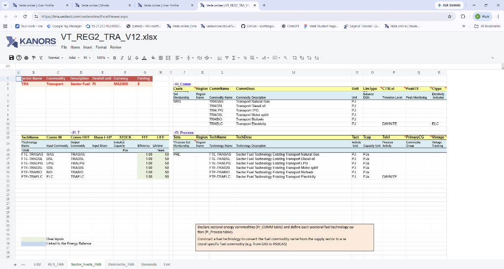

# Navigator

## Introduction

- The Navigator provides a comprehensive view of all the templates in the various folders managed by Veda for the current model.
- The Navigator is the main vehicle for accessing, importing, and coordinating the various templates that make up a model.
- Its main screen is divided into sub-windows according to the various types of templates managed by Veda.
- For GitHub-linked models, use **Pull**, **Push**, and **Commits** to keep the server folder aligned with GitHub. Double-click a file row to open it in the browser **Excel Viewer**.

## Quadrants

- **SysSetting**: Used to declare the basic structure of the model, including regions, time slices, start year, and synchronization settings. There is only one such file, and it has a fixed name that stands for System Settings.
- **Base scenario \[BS\]**: Templates used to set up the base-year (B-Y) structure of the model, including existing commodities, current process stock, and base-year end-use demand levels. The B-Y templates are named as `VT_<workbook name>_<sector>_<Version>` (for example, `VT_REG_PRI_V1`). The number and names of these templates depend on the model structure and on how the input data is organized. The B-Y templates are introduced in `DemoS_001`.
    - **BY_Trans**: Transformation files used to update information already included in the B-Y templates or to insert new information for existing processes. They work like scenario files, but their rule-based filters and update or insert changes apply only to processes and commodities that already exist in the B-Y templates. The `BY_Trans` file is introduced in `DemoS_009`.
- **BaseTrans**: Operations on the BS templates.
- **SubRES \[SR\]**: Files used to introduce new commodities and processes in the RES that are not part of the B-Y templates. Unlike B-Y templates, SubRES files are region-independent. Each SubRES file has a corresponding transformation file for adding region-specific process attributes, including availability by region. The naming conventions are `SubRES_<name>` and `SubRES_<name>_Trans`.
- **Regular Scenarios \[RS\]**: Scenario files used to update existing information or insert new information in any part of the RES, including B-Y templates, SubRES files, and Trade files. They are also used to include additional user constraints in the model. The naming convention is `Scen_<scenario name>`. These files can insert or update attributes for previously declared RES components, but they cannot add new commodities or processes. Scenario files are introduced in `DemoS_004`.
- **Demand Scenarios \[DS\]**: Demand templates include the information required to project end-use demands for energy services in each region, such as macroeconomic drivers and sensitivity series. Multiple demand files may be used to model different demand growth scenarios. The naming convention is `ScenDem_<scenario name>`. This section also contains `Dem_Alloc+Series`, which assigns a demand driver and a sensitivity or elasticity series to each end-use demand in each region. Demand files and tables are described in `DemoS_010`.
- **Trade Scenarios \[TS\]**: This section contains files where unilateral and bilateral trade links between regions are declared, together with associated data where needed. It also contains all attribute specifications for trade processes. Multiple trade files may be used for different trade scenarios or commodities. The naming convention is `ScenTrade_<scenario name>`. Trade files are introduced in `DemoS_005`.
- **Parametric Scenarios \[PS\]**: Functionality designed to support multiple runs and parametric analysis through programmed multi-value scenario sets.
- **No Seed Values \[NSV\]**: Files that do not provide seed values to any other scenario. These are processed in parallel. Veda identifies which files can be converted into NSV scenarios. This feature was introduced in 2019.

!!! note

    - 1 contains comprehensive information about the model. Veda will not synchronize without this file.
    - 2 and 3 are calibration templates for the base year.
    - 5 to 8 are groups of flexible, rule-based scenario files.

## How to use it?

### Toolbar actions

1.  **Options Menu** – Provides access to additional Navigator features:

    - **NoSeedValue Scenario**

        !!! note

            Coming soon. This section will be updated to describe the <strong>NoSeedValue Scenario</strong> in Veda Online.

    - **Tag Details**

        !!! note

            Coming soon. This section will be updated to describe <strong>Tag Details</strong> in Veda Online.

    - **Model Trade Links**

        !!! note

            Coming soon. This section will be updated to describe <strong>Model Trade Links</strong> in Veda Online.

    - **Sync Logs**

        !!! note

            Coming soon. This section will be updated to describe <strong>Sync Logs</strong> in Veda Online.

    - **Delete Logs**

        !!! note

            Coming soon. This section will be updated to describe <strong>Delete Logs</strong> in Veda Online.

2.  **Start from Scratch** – Deletes the previous model data from the database and pulls all files from the GitHub repository. You then need to synchronize the model again. Reports module data is not deleted. For a private repository, a valid GitHub token must already be saved (see [GitHub credentials](#github-credentials)).
3.  **Pull** – Replaces the model folder on the server with the latest files from GitHub. Local folder changes on the server are discarded. This does **not** change data already in the Veda Online database — run **Synchronize** after Pull if you need the database to match the new files. For a private repository, a saved GitHub token is required. If another git operation is already running on this folder, wait and try again.
4.  **Push** – Sends selected Navigator Excel files (`.xlsx` / `.xlsm`) to GitHub. Shown when **Excel Viewer** is available for your account. See [Push Excel files to GitHub](#push-excel-files-to-github).
5.  **Commits** – Lets you review your GitHub commits directly in Veda Online.
6.  **File Status** – Provides feedback about the status of the various files and the integrated database managed by Veda, according to the color legend at the bottom of the form.
    - **Not imported** – not yet read into the database
    - **Imported** – selected for importing with the next SYNC
    - **Consistent** – template is in sync with the database
    - **Inconsistent** – file has been modified after the last SYNC operation
    - **ToRemove** – previously imported template now flagged for removal from the database
    - **FileMissing** – a previously imported template that no longer exists in the template folder
    - **Error** – the file has thrown an error
    - A **red marker** on a Navigator row (and a red count on **Push**) means that Excel file has local git changes that have not been pushed.
7.  **Email Checkbox** – If this checkbox is cleared, VedaOnline will not send an email after synchronization finishes.
8.  **Synchronize** – Processes all templates in the application folder that are marked in the selected files list as `ToImport` (orange).
    - Synchronize imports all selected Excel workbooks into the Veda database. It is **not** a git Push. Processing can be observed live in the right-hand logging window or on the **Jobs Dashboard** page.
    - If Navigator Excel files have local git changes that were not Pushed, Veda Online warns you before Sync. **Continue Sync** still imports into the database (that Sync is stamped with the last pulled GitHub commit, so the database may not match GitHub). **Cancel** aborts.
    - An email is sent to the associated user upon completion. Whether the run succeeds or fails, the sync log details are included in the completion email.
    - After synchronizing a model, you can return to the Navigator.

### Push Excel files to GitHub

Use **Push** (shortcut **Alt + U**) when you have edited Navigator Excel on the server and want those workbooks on GitHub.

- A red badge on **Push** shows how many Navigator Excel files have local git changes. The same files are listed in the Push window.
- Select the files to send, enter a **commit message** (required), then click **Push**.
- Push needs a GitHub token that can **write** that repository. Save it under [User Profile](../User-Profile.md) (see also [Create Model Guide](../Create-Model-Guide.md)).
- If GitHub already has newer commits (**GitHub is ahead**), Push is blocked. Pull first. The window lists Excel files that Pull will replace. Veda Online does not Pull automatically when you click Push.
- After a successful Push you see a confirmation with a link to view the commit on GitHub. Last Synced on the model still reflects the last **Synchronize**, not the Push.

**Discard** in the same window uses the same checkboxes. It restores or removes the selected local Excel files from the last pulled commit. Discard does **not** call GitHub and does not need a write token. Confirm first; this cannot be undone. Discard is hidden when GitHub is ahead — use **Pull** instead. Files you leave unchecked stay as they are.

### GitHub credentials

GitHub-linked models use the token saved on [User Profile](../User-Profile.md).

- **Public** repositories: Pull and Start from Scratch do not require a token. **Push** always needs a write token.
- **Private** repositories: Pull, Start from Scratch, and Push require a valid saved token.
- You can **open** Excel Viewer without a token. **Save** in Excel Viewer requires a saved token and a branch that is up to date with GitHub.

### Excel Viewer

When Excel Viewer is enabled for your account, open templates in the browser instead of downloading them.

**How to open from Navigator**

- Double-click a file row in any scenario grid.
- On SubRES rows, you can also open the matching `*_Trans` workbook from the trans-file control.
- Click the **?** help control on Navigator for in-app Excel Viewer help. In the viewer, press **F1** or the toolbar help icon for keyboard shortcuts.

**Save and GitHub**

The same GitHub check applies here and when you open a source cell from [Items detail](Items-detail.md) or [Browse](Browse.md):

- Branch up to date **and** a GitHub token saved → you can edit and save.
- No saved token on a GitHub-linked model → the file opens **view only**.
- GitHub is ahead → the file still opens **view only**. Save is disabled until you **Pull**. A banner tells you to pull first. You also cannot update external links until you pull.
- If the branch check fails, the file opens view only until credentials are saved (if required) and the check succeeds.

**While the workbook is open**

- If the workbook links to other files, you may be asked to **Update** or **Don't Update**. View-only files cannot update external links.
- Save from the toolbar or **Ctrl + S**. Auto-save runs about 60 seconds after your last edit. Closing the tab with unsaved edits shows a browser warning. After a successful save, Navigator refreshes that file row.
- Maximum file size is **50 MB**. A workbook can have at most **50** worksheets.
- Charts are shown as static images. Saving writes **cell edits only**; original charts in the `.xlsx` file are preserved.
