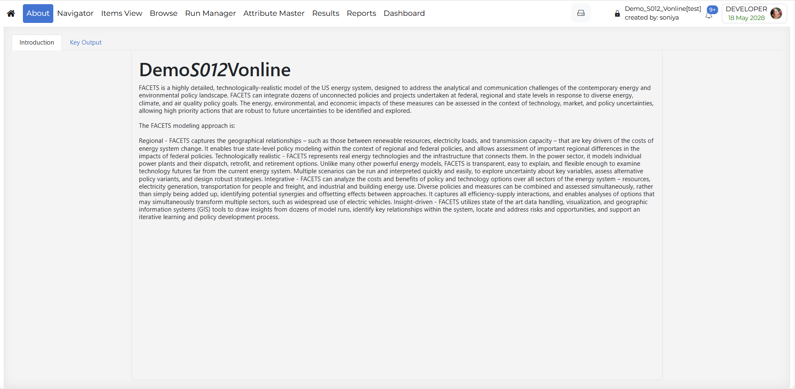

#####
About
#####

Introduction
------------

The **About** module provides general information about the selected model or
**Presenter Views**. It helps users understand the background, purpose, and important context
of the model before using other features in VedaOnline.

How to use it?
--------------

The **About** module contains two main tabs:

* **Introduction**: The **Introduction** tab displays basic descriptive information about the selected model.

* **Key Output**:
   * The **Key Output** tab displays a list of **Presenter Views**. These views are **Presenter Views**.
   * The views listed in this tab are **Presenter Views**, so this section helps users quickly access prepared output presentations or report-style views without moving to other modules.   
   * To learn more about **Presenter Views**-including how to create, share, and secure them-refer to the :ref:`Presenter Views <report-presenter-views>` section in the Reports module.
