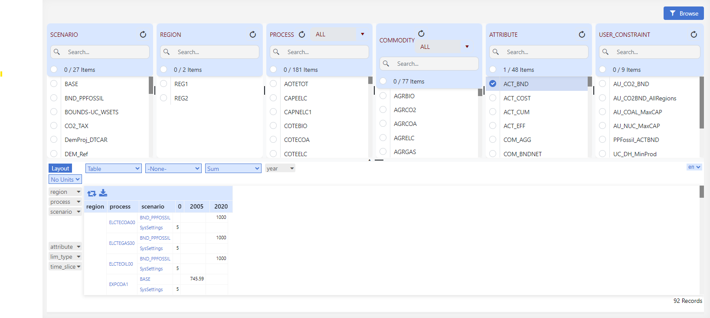
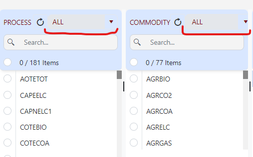

######
Browse
######

.. note::
   All data declaration for Veda models is done in Excel files. But to *visualize* models, one MUST use the interface and NOT rely on Excel files.
   Excel should be used only for the initial and additional data specification. To check the declarations or topology for any particular item, one must use Browse (or Items detail).

Browsing model input is **necessary** for two reasons:
    * You may have a syntax error and some of your declarations may have been ignored, or read differently from what you intended.
    * The declarations for a single item may be spread across several Excel files, and you will see them all in one place in this interface.

* Browse presents the actual model data.

The Browser thereby enables the user to view subsets of the assembled data in a cube by selecting the scenario(s), region(s), process(es), commodity(ies), and/or the attribute(s) of interest.
It is possible to rearrange the layout of the cube by adding/removing dimensions (columns and rows) to/from the table.

How to use?
=============

* Browse Select minimum one elements from any of the elements list and click on Browse button to load data in Pivot Grid.
* Filtering by Sets- In Process and Commodity element list, you can select User or TIMES Set from dropdown list as shown in below figure. Selected set will filter the elements linked to the Set.

.. note::
   How to use Pivot Grid? Check here.(Soon)