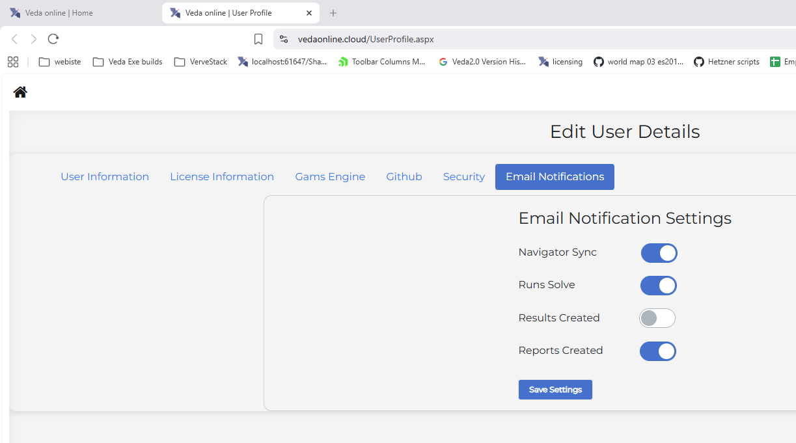
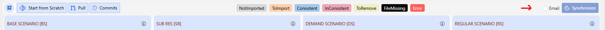
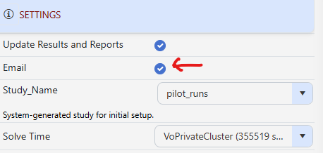

Email Notifications
=================================

This document explains **how email notifications work in Veda Online**, what triggers an email, who receives it, and how users can control notifications easily.

--------------------------------------------------
How Email Notifications Work (Quick Summary)
--------------------------------------------------

**An email is sent only when:**

1. The notification is enabled in your **User Profile**, **and**
2. The **Email checkbox for that specific action** (if available) is checked.

Both conditions must be satisfied.

--------------------------------------------------
What Will I Get an Email For?
--------------------------------------------------

.. list-table:: Email triggers and recipients
   :header-rows: 1
   :widths: 25 45 30

   * - Action you perform
     - Will you get an email?
     - Who receives the email
   * - Sync a model
     - If Profile + Navigator checkbox are enabled
     - Only you
   * - Run (Solve) model
     - If Profile + Run checkbox are enabled
     - You + study collaborators
   * - Process Results
     - If enabled in User Profile
     - Only you
   * - Process Reports
     - If enabled in User Profile
     - You + study collaborators

--------------------------------------------------
1. User Profile – Global Email Settings
--------------------------------------------------

The **User Profile** acts as the master control for email notifications.

**Path:**  
``User Profile → Email Notifications tab (/UserProfile.aspx)``

Available Options
-----------------

   User Profile – Email Notifications

- **Navigator Sync** – Emails for model synchronization
- **Runs Solve** – Emails when a model run (solve) completes
- **Results Created** – Emails when results are processed
- **Reports Created** – Emails when reports are processed

Important Notes
---------------

- These settings apply to **all models**
- You must click **Save Settings** for changes to take effect
- Saved settings automatically populate Email checkboxes in Navigator and Run Manager

--------------------------------------------------
2. Navigator – Sync Email Checkbox
--------------------------------------------------

In the **Navigator** module, an **Email** checkbox is available next to the **Synchronize** button.

Behavior
--------

   Navigator – Sync email checkbox

- Default state comes from your **User Profile**
- If unchecked, **no email** is sent for that sync
- You can check the box to send email for **this one sync only**

Override Clarification
----------------------

- This checkbox **temporarily overrides** the saved profile setting
- It does **not permanently change** your User Profile preferences

Recipient Rule
--------------

- Sync emails are sent **only to the user**
- **Model collaborators never receive Sync emails**

--------------------------------------------------
3. Run Manager – Solve Email Checkbox
--------------------------------------------------

In the **Run Manager**, an **Email** checkbox is available in Run Settings.

Behavior
--------

   Run Manager – Email checkbox

- Default state comes from your **User Profile**
- When checked, an email is sent after the run completes
- The email contains **Run Status and Report Status**

Override Clarification
----------------------

- You may enable or disable the checkbox for a **specific run only**
- This does **not modify** your saved User Profile settings

Recipient Rule
--------------

Email is sent to:

- The user
- Study collaborators (only if the study is shared)

--------------------------------------------------
4. Results – Email Behavior
--------------------------------------------------

Emails for **Results** are triggered only when results are processed from **Operation Settings**.

Key Rules
---------

- There is **no Email checkbox** in the Results module
- Email behavior is controlled **only by User Profile settings**
- Emails are sent **only to the user**
- **Study collaborators never receive Results emails**

--------------------------------------------------
5. Reports – Email Behavior
--------------------------------------------------

Emails for **Reports** are triggered only when reports are processed from **Operation Settings**.

Key Rules
---------

- There is **no Email checkbox** in the Reports module
- Email behavior is controlled **only by User Profile settings**
- Emails are sent to:
  
  - The user
  - Study collaborators

--------------------------------------------------
Important Difference: Results vs Reports
--------------------------------------------------

+------------------------------+-----------+-----------+
| Feature                      | Results   | Reports   |
+==============================+===========+===========+
| Email override checkbox      | No        | No        |
+------------------------------+-----------+-----------+
| Controlled by User Profile   | Yes       | Yes       |
+------------------------------+-----------+-----------+
| Email sent to collaborators  | No        | Yes       |
+------------------------------+-----------+-----------+

--------------------------------------------------
6. Summary – Email Permissions by Module
--------------------------------------------------

+----------+------------------------------+------------------------+-------------------------+
| Module   | Email sent by default?*      | Can change per action? | Sent to collaborators?  |
+==========+==============================+========================+=========================+
| Sync     | Yes (based on profile)       | Yes                    | No                      |
+----------+------------------------------+------------------------+-------------------------+
| Solve    | Yes (based on profile)       | Yes                    | Yes                     |
+----------+------------------------------+------------------------+-------------------------+
| Results  | No                           | No                     | No                      |
+----------+------------------------------+------------------------+-------------------------+
| Reports  | Yes (based on profile)       | No                     | Yes                     |
+----------+------------------------------+------------------------+-------------------------+

\* Default behavior depends on User Profile settings.

--------------------------------------------------
7. System Emails (Not User-Controlled)
--------------------------------------------------

The following system-level emails are **always sent** and are **not affected** by User Profile email settings:

.. list-table:: System emails
   :header-rows: 1
   :widths: 70 30

   * - Event
     - Email Sent To
   * - New user registration
     - User, Admins
   * - Licensing notifications
     - User, Admins
   * - Resource purchased
     - User, Admins