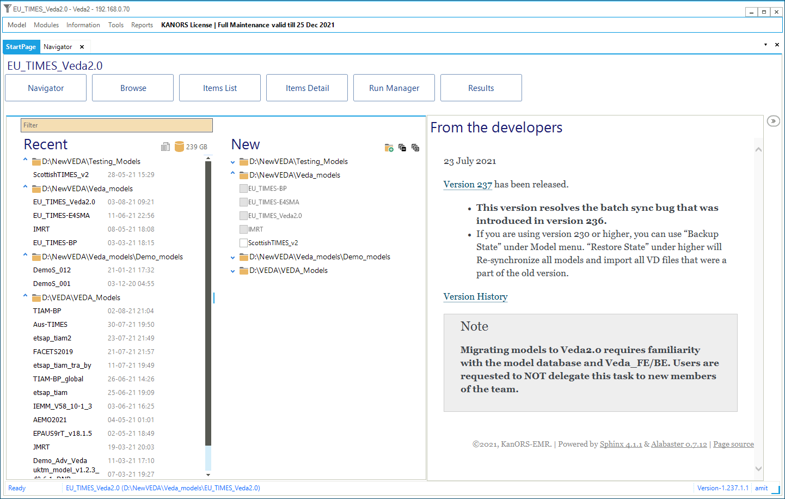
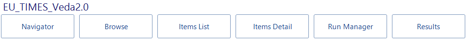

############
Start Page
############

Once a model has been selected the StartPage will have the Module buttons and the Name of the current model displayed at the top of the form.

Components
===========

* **New list**

    Shows the list of model folders once the directory, containing the model folders, is added to it.
    By default it has the 'Veda_models' directory added and will display the models that are in its root.

    .. image:: images/new_models_list-2.PNG

    New directories can be added using button:

    .. image:: images/add_dir_button.PNG

* **Recent list**

    Shows the list of models that were synced or added in navigator.

* **From the developers**

    This component displays the latest of updates regarding the development of Veda 2.0 software.
    It is updated with every release of the software.