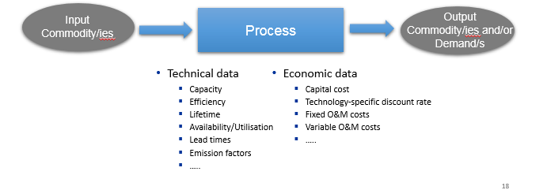
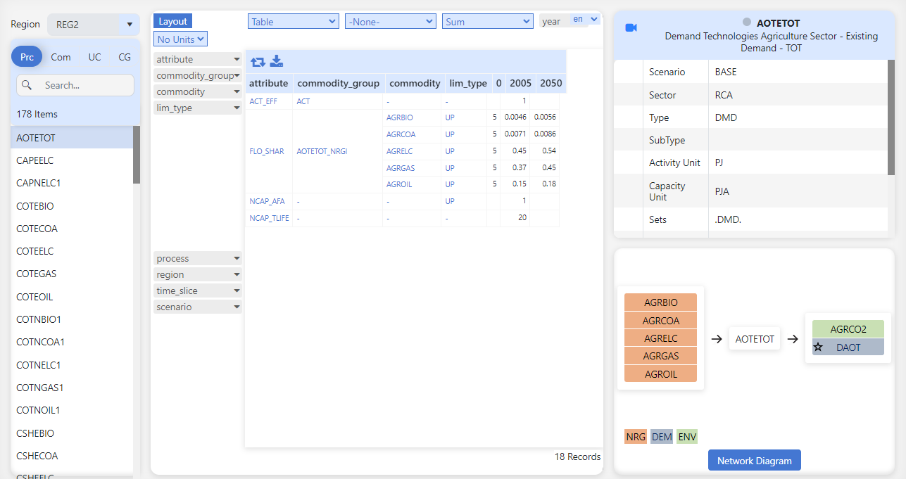
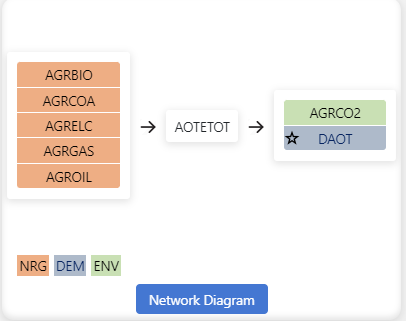

==============
Items detail
==============

This shows the basic information, topology, and parameters for all items - processes, commodities, user constraints, and commodity groups.

---------------------------------------------------
Basic Description of a TIMES Process
-----------------------------------------------------

* A process converts input commodity(ies) to output commodity(ies)
* Each process is linear (e.g. output proportional to input, investment and fixed O&M costs scale with capacity / variable O&M scale with activity)
 - A power plant converts input fuel (e.g., coal/oil/gas/nuclear/renewable source) in electricity
 - A plug-in diesel hybrid car can be modelled as a process that converts electricity and/or diesel to passenger-miles
  
* A typical national model may have ~1000 processes

    

 
How to use it?
========================

Select the region from drop down list to filter Process, Commodity, UserConstraint and Commodity Group.
Select an element from the list to see the data. 
   

    

Where we see the data?
------------------------
Pivot view
^^^^^^^^^^^^^

Detailed view
^^^^^^^^^^^^^
.. image:: images/items_view_detail_view.PNG
    :align: center
    :height: 200px

Basic view
^^^^^^^^^^^^^

Network Diagram
^^^^^^^^^^^^^^^^^

