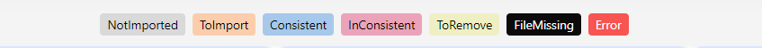

#########
Navigator
#########

Demo:

* The Navigator provides a comprehensive view of all the templates in the various folders managed by Veda for the current model.
* The Navigator is the main vehicle for accessing, importing, and coordinating the various templates that make up a model.
* Its main screen is divided into sub-windows according to the various types of templates managed by Veda.

.. image:: images/navigator.png
   :width: 600
   :align: center

Quadrants
=========

Template containing comprehensive information about the model’s basic structure (regions, sub-regions, time-periods, time-slices, …)
   1. **SysSetting**

Calibration templates for Base Year
   2. **Base scenario** [BS] – current technology mix
   3. **BaseTrans** – operations on the BS templates

   4. **SubRES** [SR] - Repository for the depiction of future technologies

Groups of flexible, “rule-based”, scenarios files:
   5. **Regular Scenarios** [RS] - files for data addition and updates.
   6. **Demand Scenarios** [DS] - projection module tied to economic indicators, fine-tuned with analyst insight.
   7. **Parametric Scenarios** [PS] - functionality designed to handle easily multiple runs and parametric analysis. “programmed” multi-value suite of scenarios.
   8. **No Seed Values** [NSV] – the files that do not provide seed values to any other scenario. These are processed in parallel. Veda provides the information of which files can be converted into NSV scenarios. (Introduced in 2019)

How to Use?
=============

* Start from Scratch - This button delete the previous model data from database and pulls all the file from github repository. You have to resynchronize your model. Reports Module data will not be deleted.
* Pull - Here all the files from git repository will be pulled but all your data in VedaOnline database will not change.
* Commits - Check your GitHub commits directly on VedaOnline.
* Email CHeckbox - After Synchronization is finished, if this checkbox is unchecked then VO will not send you the email. 
* Synchronize - It will process all templates in the application folder marked(Selected files) as ToImport(orange)
* Options Menu
   * NoSeedValue Scenario 
   * Tag Details
* Provides feedback as to the status of the various files and the integrated database managed by Veda according to colour legend at the bottom of form
    * Not imported – not yet read into the database
    * Imported – selected for importing with next SYNC
    * Consistent – templates that are in sync with the database
    * InConsistent – file has been modified after the last SYNC operation
    * ToRemove – missing template imported previously now flagged for removal from the database
    * FileMissing – previously imported template that no longer exists in the template folder
    * Error – if a file has thrown an error

SYNC Operation
===============

Synchronize imports all selected Excel workbooks into the Veda database

An e-mail is sent to the associated user to notify that the sync has started and another e-mail is sent upon completion. Whether successful or not, sync log details are also sent in the completion e-mail.

After synchronizing a model you can return to the Navigator.

