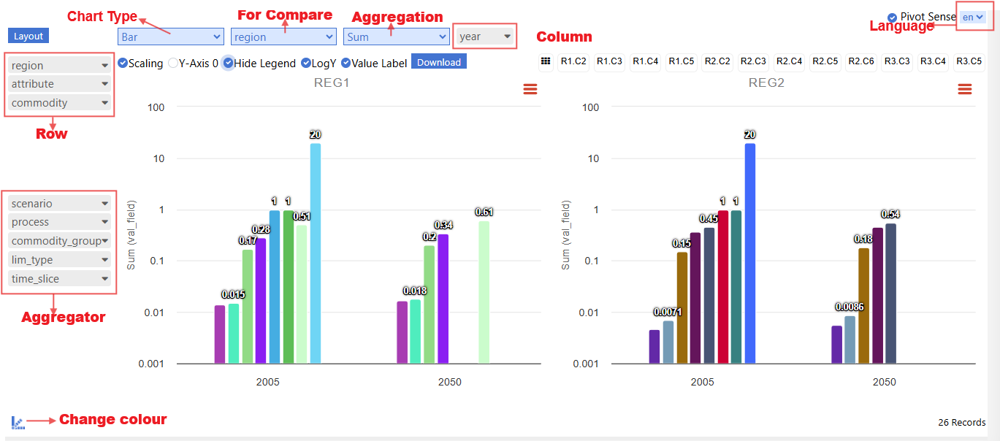

###############
Pivot Grid
###############

Introduction
------------

The Pivot Grid presents assembled model input data in an interactive, pivot-table style interface. It allows users to review the data actually read by the system, validate declarations, and compare related inputs in one view.

How to use it?
--------------

.. note::
    .. raw:: html

       <strong>Coming soon.</strong> Detailed documentation for <strong>Pivot Grid</strong> will be added here.
       The image below is a visual reference for the <strong>Pivot Grid</strong>.