#######
Reports
#######

The Advanced license of Veda2.0 offers a very powerful and efficient functionality to create reports. VEDA_BE and the Results functionality in Veda2.0 work
well for interactive and even production reporting. But there are two limitations, which are removed in the Reports feature.
First, the reporting variables are trapped in tables – we don’t have direct control over them. Second, we cannot add dimensions to the output views –
we are limited to process and commodity sets in terms of segmenting the output beyond the native indexes like attribute, region and time.
Let’s take transportation final energy (in a rich model like the JRC_EU-TIMES) as an example: one may want to see energy consumption by scenario, region, fuel,
mode, size, and technology. Scenario and region are separate indexes, and fuel can be managed with commodity sets. But we have only process sets to deal with mode,
size and technology. The only way is to create three sets of process sets, which have to be viewed separately.
The entirely new approach of Reports uses an Excel template to define reporting variables in a very efficient manner, and freely add dimensions
based process/commodity names, regions and scenarios. Further, it is possible to include exogenous data in this process, which can be used to include historical
energy balances to show historical trends in summary views, and to set up calibration checking views. Population and GDP can be introduced to look at key output
per-capita or per unit of GDP.

.. note::
    * Examples in this section are based on the `JRC_EU-TIMES model <https://github.com/KanORS-E4SMA/EU_TIMES_Veda2.0>`_. Readers can find more examples in the file LMADefs-EU_TIMES.xlsm.
    * Reports feature is active in Trial licenses.
        * This feature has been activated in all licenses starting version 1.239.1.1 **till 31 Dec 2021**, so that all users can test this feature.

Core mechanics of Report creation
=================================
* The Reports menu can be used to select scenarios, across models and users
* Reports are defined in an Excel file (like the Set definitions file)
* There are two basic types of instructions:
    * Creating variables via combination of attribute, process, commodity, timeslice, and user constraint.
    * Creating aggregations based on variable, process, commodity and region.

Variables can be created based on process/commodity sets
^^^^^^^^^^^^^^^^^^^^^^^^^^^^^^^^^^^^^^^^^^^^^^^^^^^^^^^^
Tag **~TS_Defs** is used to create variables, listed under the column "Name" below. This supports the standard process/commodity filter columns of Veda, along with Attribute,
TS (Timeslice) and UC_N. "<Pset>" embedded in the variable name creates a separate variable for each set listed in the PSET_SET column. This works for "<Cset>" and "<CName>" as well.

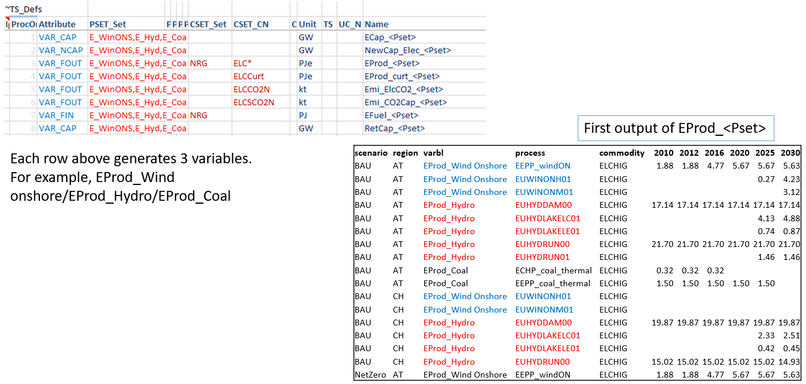

To be embedded in a variable name, the process set should appear in a table **~PSet_Map**. This has PSet | Desc | LDesc as columns. Text in the Desc column replaces
<PSet> in the variable name. For example, EProd_<PSet> with PSet=ELECOA and Desc=Coal will translate into a variable EProd_Coal. LDesc column is not in use at this time.

Aggregations based on Varbl and Process names
^^^^^^^^^^^^^^^^^^^^^^^^^^^^^^^^^^^^^^^^^^^^^
Now we have variables by generation technology, but the technology name is embedded in the variable name, which also has identfiers for the attribute. It would be better
to have the technology name in a separate column. Further, one may want to split these variables by ELE/CHP, which could be identified from the process name. Tags
**~Varbl_map** and **~Process_map** make this possible, as shown below.

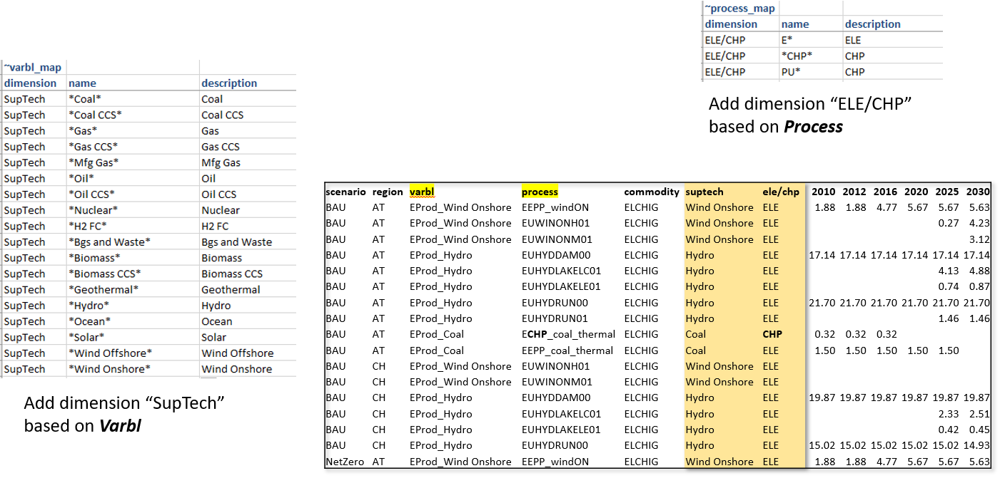

Aggregations based on Varbl and Region names
^^^^^^^^^^^^^^^^^^^^^^^^^^^^^^^^^^^^^^^^^^^^
Region groupings can be created using the **~Region_map** tag.

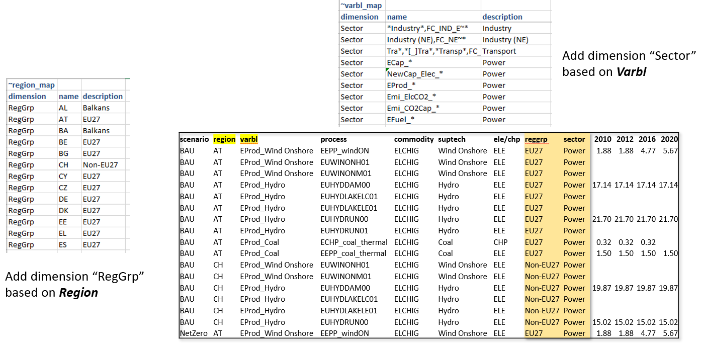

Coarser Variables can be created too
^^^^^^^^^^^^^^^^^^^^^^^^^^^^^^^^^^^^
In the first example for creating variables, the technology information was embedded in the variable name (via process set). One can create coarser variables if the naming conventions allow extracting this information
directly from process names. We look at the transport sector reporting for this.

.. image:: images/Reports/coarser_varbls.PNG
    :width: 600

Aggregations based on Commodity names
^^^^^^^^^^^^^^^^^^^^^^^^^^^^^^^^^^^^^
**~Commodity_map** tag can be used to create commodity aggregations.

.. image:: images/Reports/agg_on_comm_grps.PNG
    :width: 600

.. note::
    Like in INS tables of Veda, subsequent declarations override the previous ones. For example, one may have several different types of oil, named OILxyz. If one wants to track only Oil other, Diesel and Gasoline, then write OIL* | Oil other; OILDST | Diesel; OILGSL | Gasoline, one below the other.

Aggregations based on Process names
^^^^^^^^^^^^^^^^^^^^^^^^^^^^^^^^^^^
Multiple dimensions can be extracted from process names.

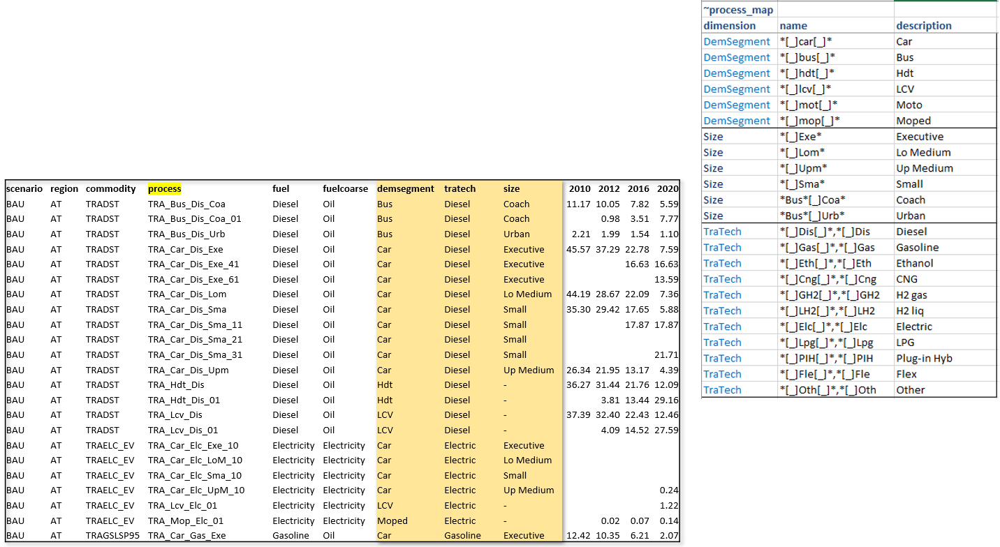

Viewing Reports
===============
Veda2.0 has a basic report viewer, which is sufficient to validate the set up of reports and for simple visualizations. Excel export and CSV dumps are possible, like in Results.

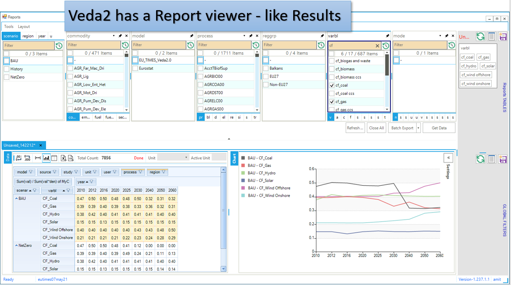

CSV output
^^^^^^^^^^
It can be consumed in applications like Tableau, Power BI, or LMA

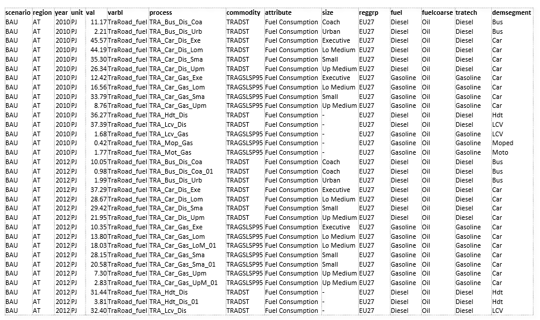

Advanced features
==================
* By default process, commodity, and timeslice dimensions are aggregated while generating variables. TS_Defs supports a column "show_me", where one can indicate dimensions **not** to be aggregated. Dimensions are indicated by their first characters. "pct" in this column will make process, commodity, and timeslice dimensions survive.
* Sankey diagrams: Reports functionality can be used to prepare data for Sankey diagrams. See the report definitions file in JRC_EU-TIMES for one way to do this.
* Unit conversion: **~UnitConv** tag can be used to convert units. For example, EProd variables can have **PJe** as the unit, which can be converted to **Twh** in the report.
* Including exogenous data
    * Historical trends/calibration check
    * Producing per/capita and per/GDP metrics
* Special attributes: some ratios are computed based on naming conventions of variables. These are dynamic weighted averages.
    * Utilization factors
    * Efficiency (by DEM)
    * CO2 intensity (by DEM)

.. note::
    It is recommended that one uses "pc" in the "show_me" column when creating new variables, to check the validity of variables and aggregations. Aggregating them makes the reports lighter, so it should be done when possible.

LMA gets a lot more out of Reports
==================================
LMA (Last Mile Analytics) is a proprietary web-based data visualization platform, which can be used for many different types of datasets, including results from TIMES models.
At this point, LMA is hosted on a server in KanORS office and users have to send VD files to KanORS (along with Report definitions file) to be uploaded. We are in the process
of deploying it in the cloud, and eventually users will be able to upload their reports directly from Veda2.0.
Access to LMA will not be included in the Advanced license; it will have to be arranged separately.

Sources and uses of main energy forms
^^^^^^^^^^^^^^^^^^^^^^^^^^^^^^^^^^^^^

* .. raw:: html

    <a href="https://lma.vedaviz.com/Presenter/Predex.aspx?pkp=1041&pkv=252583" target="_blank"><b>See it online </a> <i>select energy form</i></b>

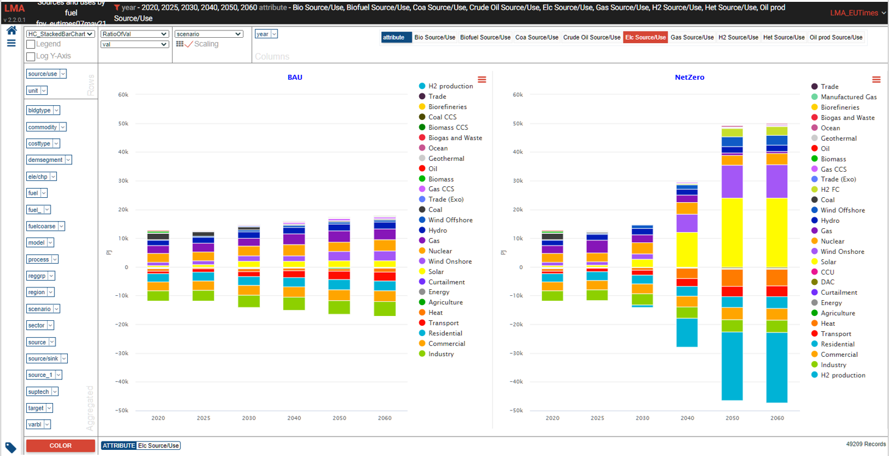

Road transport vehicles
^^^^^^^^^^^^^^^^^^^^^^^^

* .. raw:: html

    <a href="https://lma.vedaviz.com/Presenter/Predex.aspx?pkp=1041&pkv=252590" target="_blank"><b>See it online </a> <i>select region</i></b>

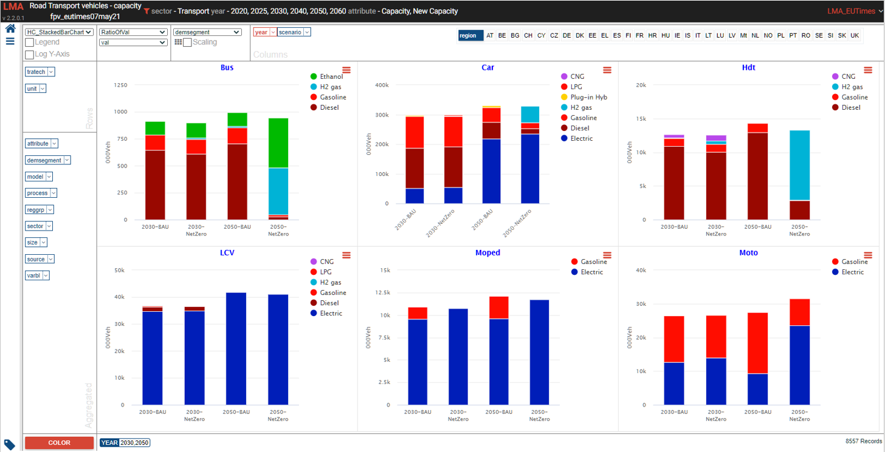

Power generation
^^^^^^^^^^^^^^^^^

* .. raw:: html

    <a href="https://lma.vedaviz.com/Presenter/Predex.aspx?pkp=1041&pkv=252586" target="_blank"><b>See it online </a> <i>select electricity/hydrogen/heat, and region</i></b>

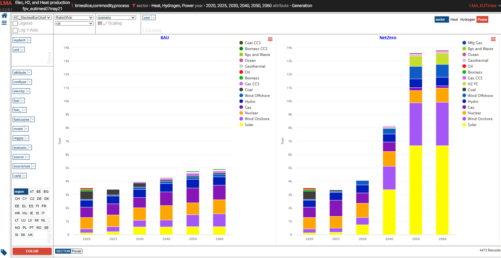

Power generation – alternate view
^^^^^^^^^^^^^^^^^^^^^^^^^^^^^^^^^

* .. raw:: html

    <a href="https://lma.vedaviz.com/Presenter/Predex.aspx?pkp=1041&pkv=252588" target="_blank"><b>See it online </a></b>

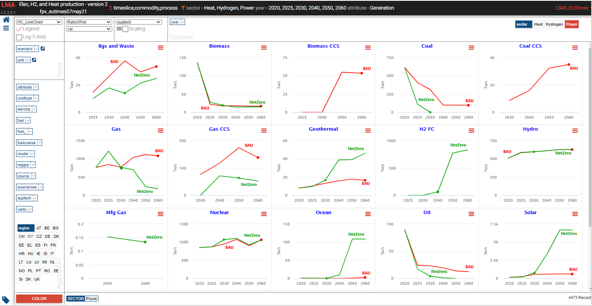

Power generation – alternate view 2
^^^^^^^^^^^^^^^^^^^^^^^^^^^^^^^^^^^

* .. raw:: html

    <a href="https://lma.vedaviz.com/Presenter/Predex.aspx?pkp=1041&pkv=252589" target="_blank"><b>See it online </a></b>

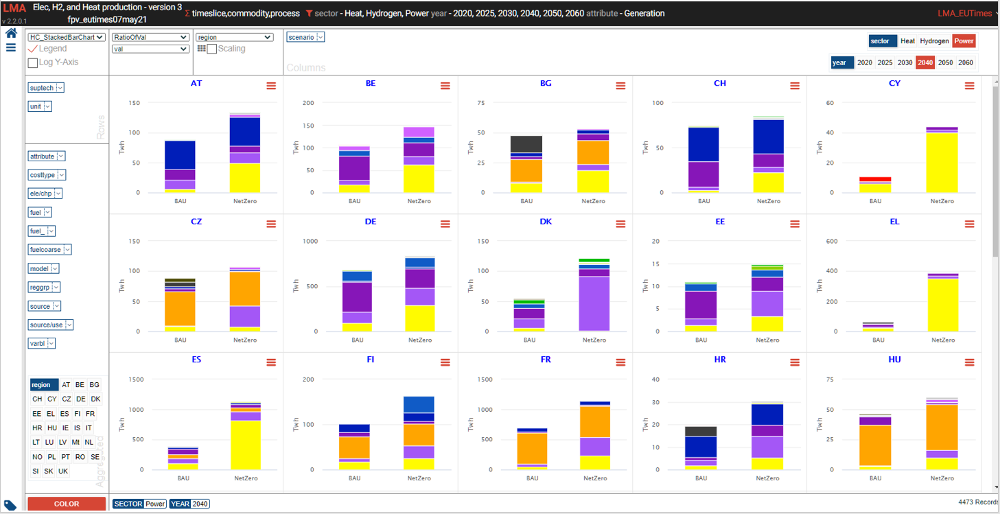

