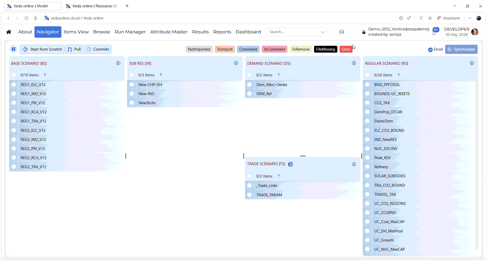

######################
Resource Usage Summary
######################

Introduction
------------

The **Resource Usage Summary** page is used to help users monitor resource
consumption in VedaOnline. It provides a summary of overall usage and also shows
detailed records for **solve time**, **sync time**, and **disk utilization**.

This page helps users understand how much resource has been used, where it was
used, and which activities contributed to that usage.

How to use it?
--------------

* Open the **Resource Usage Summary** page.
* Review the summary section at the top to understand total usage.
* Open the **Solve Time** tab to review solve-job usage.
* Open the **Sync Time** tab to review synchronization history.
* Open the **Disk Utilization** tab to review storage usage.
* Compare the usage values with the purchased values shown in the summary
  section.