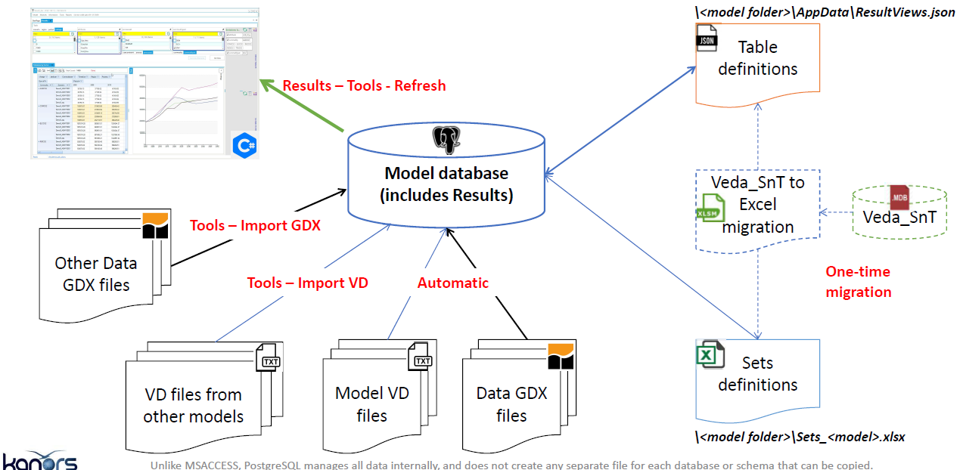

########
Results
########

Used to analyse TIMES model results. Results are all stored in the model folder (e.g. DemoS_012) and belongs to that model

* Model VD files: model results (VD files) are included automatically in the model database at the end of a successful run (e.g. \Veda\GAMS_WrkTIMES\DemoS_012).
* Results browsing: to view (and refresh) model results through dynamic pivot tables (cubes)
* Table definition: user defined tables for a specific model
	(<model folder>/AppData/ResultsView.json)
* Batch export: to export results in excel and CSV.

