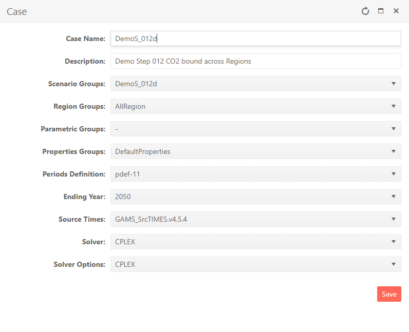
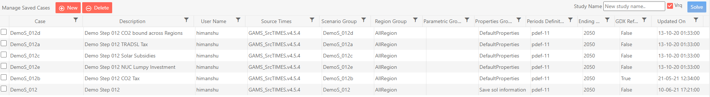

###########
Run Manager
###########

Overview
=========

* The Run Manager is used to compose and submit model runs
* Each model run is based on a Case definition comprising:
    * Scenarios
    * Regions
    * Settings
    * Properties

.. image:: images/run_manager_1.PNG
    :width: 600

Modifying RUN files
===================

There are new attributes to write TIMES switches or GAMS code at five different locations in the RUN file. Further, these declarations can also be made
at the top or bottom of scenario DD files (last two attributes in the table below). The attributes are supported by regular INS/DINS tables, in any scenario file or in SysSettings.

.. csv-table::
        :file: tables/times_switches/Times_switches_attr_loc.csv
        :widths: 1,1,1
        :header-rows: 1

There is no need to modify the RUN file template manually.

Commands will be ordered by Value column; only rows with value>0 will be considered.
If multiple scenarios send commands to the RUN file,
the blocks will be ordered as per the order of scenarios in the case definition.

.. note::
    This also opens up some new possibilities. For example, you can run parametric scenarios where base prices for elastic demands are picked up from different Reference cases.

These examples are available in the `Advanced Demo <https://github.com/kanors-emr/Model_Demo_Adv_Veda.git>`_ model.

.. csv-table:: Example 1
        :file: tables/times_switches/Example1.csv
        :widths: 20,35,15,5,50
        :header-rows: 2

If you want to use single quotes <'> in your instructions, then it is necessary to use a DINS table, as shown below. DINS tables need process or commodity specification. You can use any valid
process instead of IMPNRGZ; it will have no impact on the outcome.

.. csv-table:: Example 2
        :file: tables/times_switches/Example2.csv
        :widths: 20,50,30
        :header-rows: 2

Case definition
================

* Create a New Case by providing the core information for the case definition
    * Case Name - name of the case
    * Description - description of the case
    * Scenario Group - scenarios to be included in this run
    * Region Group - regions to be included in this run
    * Parametric Group - driver scenario for a suite of runs
    * Properties Group - what GAMS options/switch are to be employed
    * Periods Definition - period definition for the run
    * Ending Year - last period for the run
    * Source TIMES - where does the TIMES code reside
    * Solver - which solver is to be used
    * Solver Options - which solver options to use
    * GDX References - GDX files to be used for freezing periods, elastic demand base prices or IRE bounds/prices

Model run submission
=====================

* Select one (or more) of the cases in the Managed Save Cases section and click SOLVE

* Solve status of model case can be tracked in JobsDashboard.
