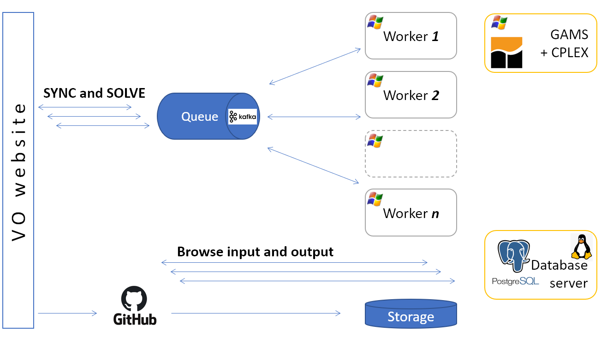

#############
Introduction
#############

Veda online (VO) enables working with TIMES models via Internet Browsers. Veda model folders are expected to be on GitHub, and all the core functionality of Veda2.0 - Synchronizing Excel files,
browsing input data, running models, and looking at results/reports - is available online.

VO users can make their models accessible to other VO users with control over what modules are visible and the downloadability of input/output. This makes collaborative development
much more efficient. Further, this opens the possibility to disseminate models - to create model users.

It offers several advantages over Veda2.0 to individual users as well:
    * No software setup/updates needed
    * Enforces version control discipline via GitHub
    * Model synchronization and runs on state-of-the-art servers
    * Availability of model input/output no longer dependent on specific machines
    * Far superior data visualization in Reports, Results, and Browse.

While I can manage incremental modifications with VO, Veda2.0 remains my preferred tool for model development and debugging.

VO is an open website. Public models are visible to visitors even without logging in. An annual subscription is required to create models and perform runs. Making model runs
also needs GAMS/CPLEX cloud service, but that is managed by KanORS.

Veda
^^^^
VEDA means “Knowledge” in Sanskrit. It is a software tool to convert modeler's knowledge into input for models, and output from models into knowledge.
Veda Online is a data handling system for The Integrated MARKAL-EFOM System (TIMES) - a bottom-up optimization model for energy-environment systems.
Veda is based on a modular approach that organizes the model input data, and results, into an integrated database.
Information is visible via tabular browsing (data cubes) and network diagrams.
It is used to develop and manage model runs and to analyse model results.

Philosophy and core principles
==============================
    * Most of the data used by energy modelers is already in spreadsheets, or it can get there easily. The interface should be able to read formats that analysts find intuitive, rather than forcing them to enter information via a separate UI.
    * Assumptions should be expressed in the original form; data pre-processing should be minimal.
        * Veda can read a wide variety of layouts - timeseries, regions in columns, attributes in columns etc., to minimize structural pre-processing.
        * Veda allows rule-based manipulation of parameters and set declarations, to minimize numerical pre-processing. Massive amounts of data can be introduced or modified with very few instructions.
    * System should be modular – easy to activate/deactivate/replace sectors or regions. Different analysts should be able to work on different sectors or regions in parallel.
    * Structures and data that is common across regions should be declared only once.
    * Different layers of assumptions should coexist so that they can be activated/deactivated/permuted at run-time.

Veda lexicon
============
Here are some keywords that have acquired their own special meanings over the last two decades.

    * **Templates**: a template is normally defined as *something that determines or serves as a pattern, a model.* In the VEDA world, this refers to all the Excel files that constitute a model.
    * **Template Folder**: The folder that contains all these files is called the *Template folder* of the model.
    * **Scenario**: the closest normal definition is *an imagined or projected sequence of events, especially any of several detailed plans or possibilities.* This is perhaps the most sticky misnomer that MARKAL/TIMES modelers have been living with. It is used with different meanings for model input and output. On the input side, this implies a bunch of input data that can be given a name. Examples: all starting year data is normally called BASE scenario; time series of CO2 Tax can be called CO2Tax scenario; assumptions on future capacity bounds on hydro and wind can be called RenewablePotential Scenario. We choose a group of such scenarios and give it a Case or Run name while submitting a run. When handling the solution with this case/run name, it is called a Scenario again. Normally, this name represents the key assumptions that justified the run – CO2_tax_100, Hi_RE_potential, for example.
    * **Transformation**: normal definition is *the operation of changing an expression into another in accordance with a mathematical rule.* Here, it is used as an adjective for tables that are used to create new data (or modify existing data) in a rule-based manner.
    * **SubRES**: this has no meaning normally; it is our original contribution to the English language! With the regular meaning of RES – Reference Energy System, this refers to a part of the overall RES of the model. Generally, this is a set of processes and commodities that can be included/excluded from the model without interrupting the core flows. Sequestration would be a good example: all the processes and auxiliary commodities created to model sequestration could be put in an independent SubRES so that they can be included/excluded in model runs freely (at the time of submitting a run) without having to change any parameter values. These are commonly used to define the new technologies for models.
    * **Base-Year**: the first period of the modeling horizon. Since TIMES allows flexible period lengths, normally this is a single year so that the values are annual rather than averages over several years.
    * **Super-Region**: it is a user-defined label that maps to one or more model regions. The mapping is declared in the SysSettings file. See the sheet "Region-Time Slices" of this file in the DemoS_005 model, for example; “REG” maps to REG1 and REG2. Demo_Adv_Veda model has much richer use of this facility.
    * **Dummy Imports**: to avoid infeasibilities arising from broken RES connections or too tight calibration bounds, VEDA creates a dummy source for each NRG, MAT and DEM commodity that is defined in the model. The basic idea is to have these sources supply at prices that are an order of magnitude higher than the normal prices in the model, so that the source of the potential infeasibility can be easily located. One process is created for each commodity type, and their operation cost can be controlled via the SysSettings file (or any other scenario file).
    * **SYNC**: Synchronize, is used for the operation one launches from the VEDA navigator, which reads the information for various Excel files into databases.

Architecture
============
All input data resides in Excel workbooks. XLSX/M format is recommended for Veda2.0. Modularity is one of the core features of Veda. This is to make major reconfigurations
possible and efficient. This also makes it easier for multiple people to work on different parts of the model in parallel. This is achieved by segregating the input data into the following sections:

    * Core definitions of regions, timeslices, modeling years, and commodities
    * Technologies with existing stock
    * New technologies
    * Demands
    * Trades
    * Additional parameter definitions for technologies and commodities

There can be multiple files for each type of data, apart from the first one - the core definitions. In each model folder, these files are organized in the structure shown below.

Files expected in these sub-folders are as under:
    * Root folder has SysSettings (core definitions), Base-year templates (existing techs), and set definitions.
    * SubRES has files with new technologies
    * SuppXLS has the scenario files (additional parameters (or modifications) for all existing and new technologies and commodities)
        * Demands has the DEM_Alloc+Series to allocate drivers to demands, and ScenDem_<scenario name> for driver scenarios.
        * Trades has ScenTrade__Trade_Links for defining trade links, and ScenTrade_<scenario name> for declaring attributes for trade processes (which can also be done in regular scenario files).

Veda reads these Excel files into a PostgreSQL database, offers tabular and graphical views of the data as TIMES parameters, and submits the data to the TIMES
code.

User types and pricing
^^^^^^^^^^^^^^^^^^^^^^

Veda online supports the following types of users:

    * **Guest:** Visitors who are not logged in. They will have access to all open models on VO, with download premissions based on the settings used by model owners. They will not be able to save views under Results and Reports.
    * **Trial:** A trial licnese is allocated by default after signing up on VO. This offers full functionality for 7 days with 5 hours of Solve time.
        * Users are requested to submit only modest runs during the Trial period. Less than 5GB RAM usage and Less than 10 Min of Solve time.
    * **Free:** Trial users automatically transition to free users. Free users will have access to open models **and** models shared with them by Developer license holders.
        * Models and results created under trial period wil be removed after one month if the user does not buy a license before that.
    * **Developer:** Developer license will let you create models, run cases, and view results and reports. Any private and public model can be shared with *any* user who is registerd on VO. You can purchase GAMS Engine hours to perform runs in the cloud; they can always be done locally if you have a GAMS license. VO can send up to 4 concurrent runs on the GAMS Engine.
    * **Academic:** Developer functionality is offered at discounted prices to Academics (Degree-granting institutions). In addition, this license allows access to the NEOS server. VO can send up to 4 concurrent runs on the NEOS server.
        * **Dormant:** Developer and Academic license holders who do not wish to modify their models or make new runs can become Dormant users - to have continued access to their models and results.
        * Models and results wil be removed one month after a subscription expires.
            * It will be possible to resurrect the model and runs if the user resubscribes in future. Model states are preserved in GitHub, and the output files can be saved locally - to be uploaded to VO under a new subscription.

**Annual subscription fee for the Veda online Platform**

*All prices are in US Dollars*

.. csv-table::
        :file: tables/pricing_vo.csv
        :widths: 1,1,1,1,2
        :header-rows: 1

**Solver time**

GAMS Engine is available at $12.37 - $13.11 per hour, depending on the machine size. Users can prepay for any number of hours (>= 40). The default machine size can be set under user profile, and it can be changed at the time of launching a set of runs from the VO Run manager. These hours can be transferred across years but they cannot be
refunded. Note that the GAMS Enging price is subject to change depending upon GAMS policy.

.. csv-table::
        :file: tables/pricing_ge.csv
        :widths: 1,1,1,1,1,2
        :header-rows: 1

Users can also buy GAMS Engine time from GAMS separately and launch runs from VO using their own credentials.