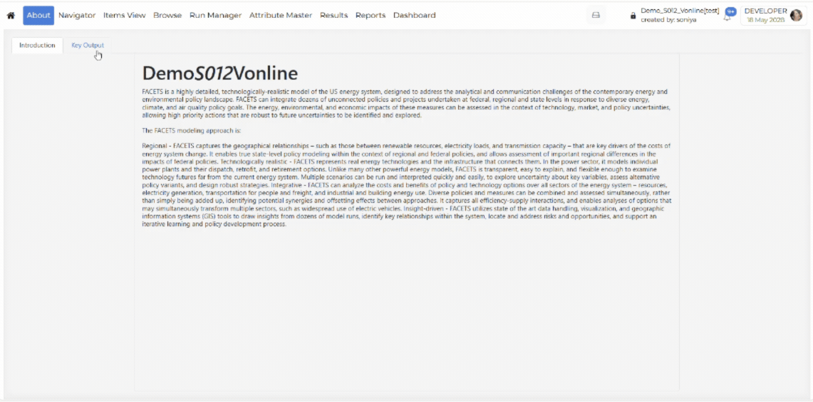

############
About module
############

Introduction
------------

The **About** module provides general information about the selected model or
**Presenter Views**. It helps users understand the background, purpose, and important context
of the model before using other features in VedaOnline.

.. figure:: ../images/about_modules.png
   :alt: About modules
   :align: center

How to use it?
--------------

The **About** module contains two main tabs:

* **Introduction**: The **Introduction** tab displays basic descriptive information about the selected model.

* **Key Output**:
   * The **Key Output** tab provides a curated list of **Views** known as **Presenter Views**.
   * This tab allows users to quickly access pre-configured output presentations or report-style views without navigating away from the About module.
   * To share a **Presenter View** with others, simply click the **Copy** button next to the desired view.
   * For detailed information on creating, sharing, and managing **Presenter Views**, see the :ref:`Presenter Views <report-presenter-views>` section in the Reports module.

