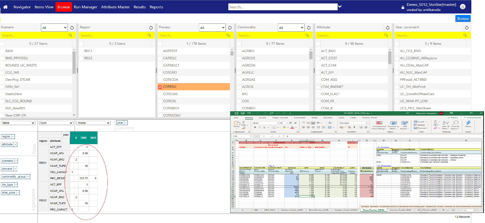
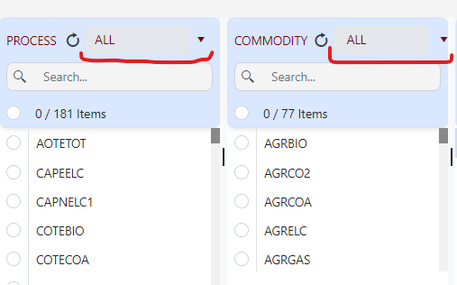

######
Browse
######

Introduction
------------

.. note::

   All data declarations for Veda models are done in Excel files. To *visualize* the model, use the interface instead of relying on Excel files.
   Excel should be used for initial and additional data specification. To check declarations or topology for a particular item, use Browse (or Items detail).

Browsing model input is **necessary** for two reasons:

* You may have a syntax error and some of your declarations may have been ignored, or read differently from what you intended.
* The declarations for a single item may be spread across several Excel files, and you will see them all in one place in this interface.
* Browse presents the actual model data.

   

The Browser thereby enables the user to view subsets of the assembled data in a cube by selecting the scenario(s), region(s), process(es), commodity(ies), and/or the attribute(s) of interest.
It is possible to rearrange the layout of the cube by adding/removing dimensions (columns and rows) to/from the table.

How to use it?
---------------

Load data in Pivot Grid
^^^^^^^^^^^^^^^^^^^^^^^

* Select at least one element from any element list.
* Click **Browse** to load data in the Pivot Grid.

Filter using sets
^^^^^^^^^^^^^^^^^

* In the Process and Commodity element lists, select **User Set** or **TIMES Set** from the dropdown (as shown below).
* The selected set filters the linked elements.

