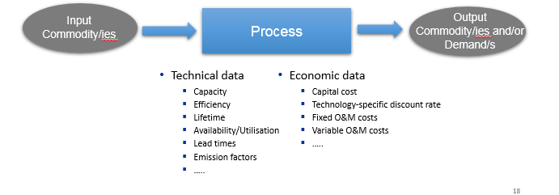
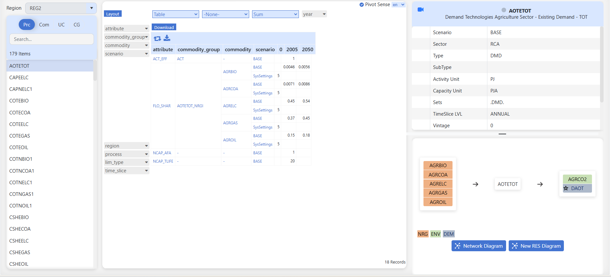

==============
Items detail
==============

Introduction
------------

This shows the basic information, topology, and parameters for all items - processes, commodities, user constraints, and commodity groups.

Basic description of a TIMES process
^^^^^^^^^^^^^^^^^^^^^^^^^^^^^^^^^^^^

* A process converts input commodity(ies) to output commodity(ies)
* Each process is linear (e.g. output proportional to input, investment and fixed O&M costs scale with capacity / variable O&M scale with activity)

  - A power plant converts input fuel (e.g., coal/oil/gas/nuclear/renewable source) in electricity
  - A plug-in diesel hybrid car can be modelled as a process that converts electricity and/or diesel to passenger-miles

* A typical national model may have ~1000 processes

    

 
How to use it?
--------------

* Select the region from the drop-down list to filter Process, Commodity, UserConstraint, and Commodity Group.
* Select an element from the list to see the data.
   

    

Where to view the data
^^^^^^^^^^^^^^^^^^^^^^
**Pivot View**
    .. image:: ../images/items_view_pivot.png
        :align: center

    .. note::
        .. raw:: html

            <strong>Coming soon.</strong>
            Detailed documentation for <strong>Pivot view</strong> will be added here.
            The image above is a visual reference.

**Detailed View**    
    .. image:: ../images/items_view_detail_view.png
        :align: center
        :height: 200px

    .. note::
        .. raw:: html

            <strong>Coming soon.</strong>
            Detailed documentation for <strong>Detailed view</strong> will be added here.
            The image above is a visual reference.

**Basic View**    
    .. image:: ../images/items_view_input_output.png
        :align: center
        :height: 250px

    .. note::
        .. raw:: html

            <strong>Coming soon.</strong>
            Detailed documentation for <strong>Basic view</strong> will be added here.
            The image above is a visual reference.

**Network Diagram**    
    .. image:: ../images/items_view_network_diag.png
        :align: center
        :height: 300px

    .. note::
        .. raw:: html

            <strong>Coming soon.</strong>
            Detailed documentation for <strong>Network Diagram</strong> will be added here.
            The image above is a visual reference.

**New RES Diagram**    
    .. image:: ../images/items_view_new_res_diag.png
        :align: center
        :height: 300px

    .. note::
        .. raw:: html

            <strong>Coming soon.</strong>
            Detailed documentation for <strong>New RES Diagram</strong> will be added here.
            The image above is a visual reference.
