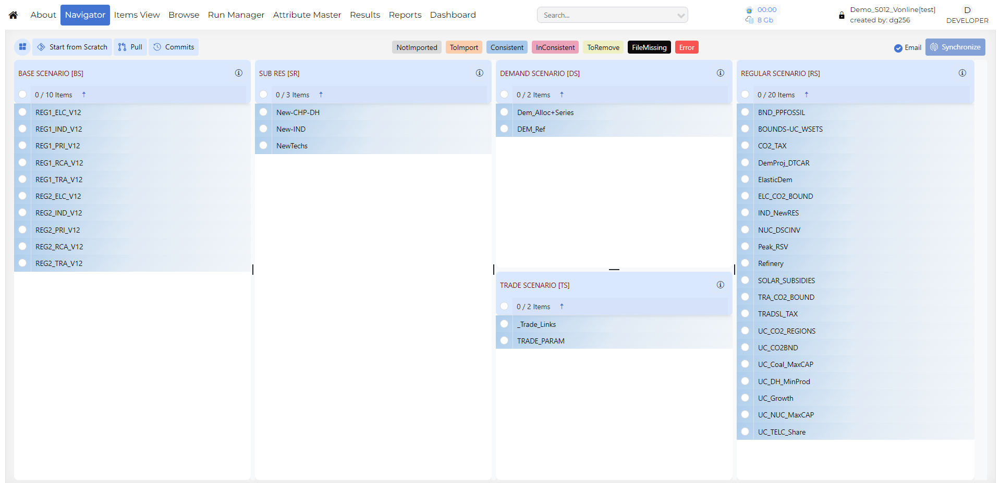
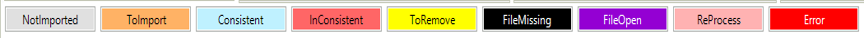

#########
Navigator
#########

Introduction
------------

* The Navigator provides a comprehensive view of all the templates in the various folders managed by Veda for the current model.
* The Navigator is the main vehicle for accessing, importing, and coordinating the various templates that make up a model.
* Its main screen is divided into sub-windows according to the various types of templates managed by Veda.

Quadrants
---------

* **SysSetting**: Used to declare the basic structure of the model, including regions, time slices, start year, and synchronization settings. There is only one such file, and it has a fixed name that stands for System Settings.

* **Base scenario [BS]**: Templates used to set up the base-year (B-Y) structure of the model, including existing commodities, current process stock, and base-year end-use demand levels. The B-Y templates are named as ``VT_<workbook name>_<sector>_<Version>`` (for example, ``VT_REG_PRI_V1``). The number and names of these templates depend on the model structure and on how the input data is organized. The B-Y templates are introduced in ``DemoS_001``.

  * **BY_Trans**: Transformation files used to update information already included in the B-Y templates or to insert new information for existing processes. They work like scenario files, but their rule-based filters and update or insert changes apply only to processes and commodities that already exist in the B-Y templates. The ``BY_Trans`` file is introduced in ``DemoS_009``.

* **BaseTrans**: Operations on the BS templates.

* **SubRES [SR]**: Files used to introduce new commodities and processes in the RES that are not part of the B-Y templates. Unlike B-Y templates, SubRES files are region-independent. Each SubRES file has a corresponding transformation file for adding region-specific process attributes, including availability by region. The naming conventions are ``SubRES_<name>`` and ``SubRES_<name>_Trans``.

* **Regular Scenarios [RS]**: Scenario files used to update existing information or insert new information in any part of the RES, including B-Y templates, SubRES files, and Trade files. They are also used to include additional user constraints in the model. The naming convention is ``Scen_<scenario name>``. These files can insert or update attributes for previously declared RES components, but they cannot add new commodities or processes. Scenario files are introduced in ``DemoS_004``.

* **Demand Scenarios [DS]**: Demand templates include the information required to project end-use demands for energy services in each region, such as macroeconomic drivers and sensitivity series. Multiple demand files may be used to model different demand growth scenarios. The naming convention is ``ScenDem_<scenario name>``. This section also contains ``Dem_Alloc+Series``, which assigns a demand driver and a sensitivity or elasticity series to each end-use demand in each region. Demand files and tables are described in ``DemoS_010``.

* **Trade Scenarios [TS]**: This section contains files where unilateral and bilateral trade links between regions are declared, together with associated data where needed. It also contains all attribute specifications for trade processes. Multiple trade files may be used for different trade scenarios or commodities. The naming convention is ``ScenTrade_<scenario name>``. Trade files are introduced in ``DemoS_005``.

* **Parametric Scenarios [PS]**: Functionality designed to support multiple runs and parametric analysis through programmed multi-value scenario sets.

* **No Seed Values [NSV]**: Files that do not provide seed values to any other scenario. These are processed in parallel. Veda identifies which files can be converted into NSV scenarios. This feature was introduced in 2019.

.. note::

   * 1 contains comprehensive information about the model. Veda will not synchronize without this file.
   * 2 and 3 are calibration templates for the base year.
   * 5 to 8 are groups of flexible, rule-based scenario files.

How to use it?
--------------

SYNC Operation
^^^^^^^^^^^^^^

Synchronize imports all selected Excel workbooks into the Veda database. The processing can be seen live on the right logging window or on the JobsDashboard page. An e-mail is also sent to the associated user upon on completion. Whether successful or not, sync log details are also sent in the completion e-mail.
After synchronizing a model, you can return to the Navigator.

User Inputs
^^^^^^^^^^^

#. **Start from Scratch** - This button deletes the previous model data from the database and pulls all the files from the GitHub repository. You then need to synchronize the model again. Reports module data is not deleted.
#. **Pull** - Pulls all files from the Git repository without changing your data in the VedaOnline database.
#. **Commits** - Lets you check your GitHub commits directly in VedaOnline.
#. **Email Checkbox** - If this checkbox is cleared, VedaOnline will not send an e-mail after synchronization finishes.
#. **Synchronize** - Processes all templates in the application folder that are marked in the selected files list as ``ToImport`` (orange).
#. **Options Menu**

   * NoSeedValue Scenario
   * Tag Details
   * Model Trade Links
   * Sync Logs
   * Delete Logs

File Status
^^^^^^^^^^^

Provides feedback about the status of the various files and the integrated database managed by Veda, according to the color legend at the bottom of the form.

* **Not imported** – not yet read into the database
* **Imported** – selected for importing with next SYNC
* **Consistent** – templates that are in sync with the database
* **Inconsistent** – file has been modified after the last SYNC operation
* **ToRemove** – missing template imported previously now flagged for removal from the database
* **FileMissing** – a previously imported template that no longer exists in the template folder
* **Error** – if a file has thrown an error
