#######
Reports
#######

Introduction
------------

TIMES model results are often too granular for people outside the core modeling team. Modelers usually share outputs with clients and stakeholders through Excel workbooks or PowerPoint presentations.
Modeling becomes more effective when end users can interact with results directly, instead of relying only on the modeling team.

The Reports feature of VO makes this possible.

You can create reporting variables with names that domain users can easily understand, such as "Electricity Generation" and "Final Energy". You can then add dimensions such as Sector, Fuel, Enduse, Technology, Electricity/CHP, and CCS/Non-CCS to disaggregate those variables.

Take Transportation final energy in a rich model like JRC_EU-TIMES as an example: you may want to view consumption by scenario, region, fuel, mode, size, and technology.
Scenario and region are separate indexes, and fuel can be managed with commodity sets. Mode, size, and technology, however, typically require process sets, which are often viewed separately.
The Reports approach uses an Excel template to define reporting variables efficiently and add dimensions based on process or commodity names, regions, and scenarios.
You can also include exogenous data, such as historical energy balances, for trend analysis and calibration checks. Population and GDP can be included to evaluate outputs per capita or per unit of GDP.

.. note::

   * Examples in this section are based on the `JRC_EU-TIMES model <https://github.com/KanORS-E4SMA/EU_TIMES_Veda2.0>`_. Readers can find more examples in the file LMADefs-EU_TIMES.xlsm.
   * Reports feature is active in Trial licenses.

How to use it?
--------------
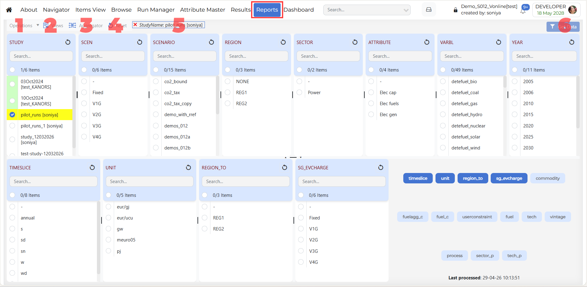

1. Operations
^^^^^^^^^^^^^
The **Operations** menu contains actions related to report processing and case management.

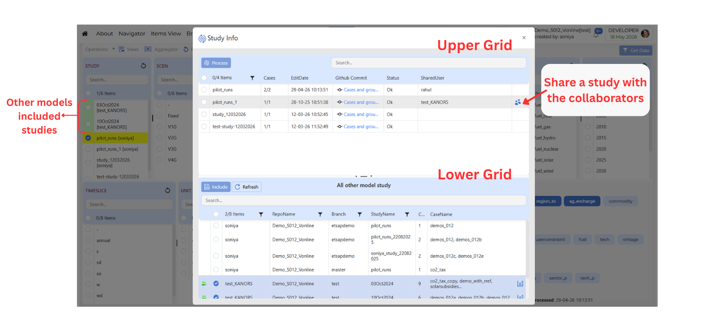

* **Process Study**
    When **Process Study** is opened, a **Study Info** window is shown. This window contains two grids.

    * **Upper Grid**
        The upper grid contains the studies that belong to the current user or current model.

    * **Shared Studies with Collaborators** 
        To share a study with collaborators from the **upper grid**, follow these steps

        * To share a study with others, move your mouse pointer over a row in the upper grid. When the user (person) icon appears, click on it to open the **Share study with** dialog box.
        * Use the search bar to find users or click **Select All** to choose all available users from the list displayed.
        * Select the desired users.
        * Click **Save** to share the selected study.
        * Once sharing is complete, the names of the collaborators will appear in the **SharedUsers** column.

    * **Lower Grid**
        The **lower grid** displays studies that have been shared with you from **other models**-that is, models owned by other users who have chosen to share their studies with you.

    * **Including Shared Studies**
        To include shared studies from the **lower grid**, follow these steps

        * **Select** one or more studies that you want to include.
        * **Select** one or more studies that you want to include.
        * **Click** the **Include** button.
        * The selected studies will be **added to your current model** for reporting use.
        * You will see a **Success** message to confirm that the studies were included.
        * Once included
            * These shared studies will appear in the **STUDY** dimension on the Reports page.
            * Studies that come from another user's model are **highlighted in green** for easy identification.

* **Delete Cases**
    Delete the saved reports in the current model.

2. Views
^^^^^^^^
.. include:: ../shared/_views_common.rst

.. _report-presenter-views:

Presenter Views
"""""""""""""""
The **Report Presenter Views** feature allows controlled sharing of report data.

Sometimes, a user may want to show selected results or analysis to another person, but may not want to give that person access to the complete model, study, or full result dataset.

In such cases, the user can create a Presenter View and share only the required report information.

This helps users share important analysis safely and in a more focused way.

.. image:: ../images/gifs/reports_presenter_view.gif
   :align: center
   :width: 600

How to use Report Presenter Views?
''''''''''''''''''''''''''''''''''
* Share selected report information with other users
* Present charts, tables, and analysis outputs in a clean format
* Avoid sharing the complete model or study
* Control what information the shared user can view
* Share report data for review, discussion, or presentation
* Provide temporary access to selected report content

Password Protection
'''''''''''''''''''
* While creating or sharing a Presenter View, the user can set a password.
* This adds an extra layer of security. Only users who have the correct password can open the shared Presenter View.
* Password protection is useful when the shared report contains important or restricted information.

Expiry Date
'''''''''''
* The user can also set an expiry date for the Presenter View.
* The expiry date controls how long the shared Presenter View will remain accessible.
* After the expiry date is reached, the shared user will no longer be able to open the Presenter View.
* This helps users share report information for a limited time without keeping access open permanently.

.. note::

   * Report Presenter Views are important because they allow users to share selected information without giving full access to the model or study.
   * They provide a controlled and secure way to present report outputs to other users.
   * With password protection and expiry date settings, users can decide who can access the Presenter View and for how long.

3. Aggregator
^^^^^^^^^^^^^

.. note::
    .. raw:: html

       <strong>Coming soon.</strong> This section will describe the <strong>Aggregator</strong> feature in Reports.

4. Reset
^^^^^^^^

The **Reset** option clears the current report selections and removes the applied filters from the page.

5. Global Filters
^^^^^^^^^^^^^^^^^

* The **Global Filters** default is applied to the latest study.
* When a row in the Results grid is **highlighted in yellow**, it means that a global filter is applied to that row.
* Press **Ctrl key** and click on the row to apply the filter to the row.

6. Get Data
^^^^^^^^^^^

.. include:: ../shared/_pivot_common.rst

Right-click Functionality
^^^^^^^^^^^^^^^^^^^^^^^^^

The Reports module provides right-click (context menu) capability on selected items in any dimension. This menu offers fast access to key actions relevant to the item you have selected, helping you explore report data more efficiently without navigating away from your main workflow.

**Dimension-Specific Options**

* Right-click on the selected dimension items to open the context menu. the menu includes the following options:
   * **Show Detail** – Opens an information dialog with detailed data about the selected item (for example, ``period - 2015 information`` or ``process - COTEELC information``).

Core mechanics of Report creation
---------------------------------
* The Reports menu can be used to select scenarios, across models and users
* Reports are defined in an Excel file (like the Set definitions file)
* There are two basic types of instructions:
    * Creating variables via combination of attribute, process, commodity, timeslice, and user constraint.
    * Creating aggregations based on variable, process, commodity and region.

Variables can be created based on process/commodity sets
^^^^^^^^^^^^^^^^^^^^^^^^^^^^^^^^^^^^^^^^^^^^^^^^^^^^^^^^
Tag **~TS_Defs** is used to create variables, listed under the column "Name" below. This supports the standard process/commodity filter columns of Veda, along with Attribute,
TS (Timeslice) and UC_N. "<Pset>" embedded in the variable name creates a separate variable for each set listed in the PSET_SET column. This works for "<Cset>" and "<CName>" as well.

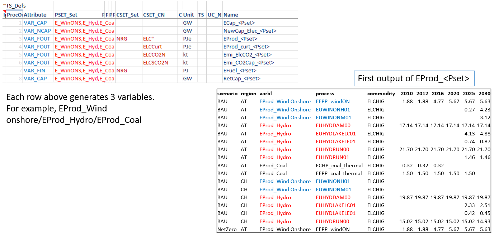

To be embedded in a variable name, the process set should appear in a table **~PSet_Map**. This has PSet | Desc | LDesc as columns. Text in the Desc column replaces
<PSet> in the variable name. For example, EProd_<PSet> with PSet=ELECOA and Desc=Coal will translate into a variable EProd_Coal. LDesc column is not in use at this time.

Aggregations based on Varbl and Process names
^^^^^^^^^^^^^^^^^^^^^^^^^^^^^^^^^^^^^^^^^^^^^
Now we have variables by generation technology, but the technology name is embedded in the variable name, which also has identfiers for the attribute. It would be better
to have the technology name in a separate column. Further, one may want to split these variables by ELE/CHP, which could be identified from the process name. Tags
**~Varbl_map** and **~Process_map** make this possible, as shown below.

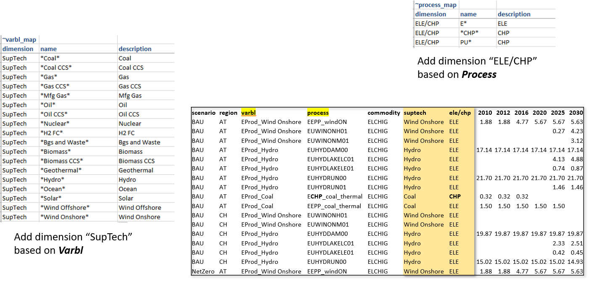

Aggregations based on Varbl and Region names
^^^^^^^^^^^^^^^^^^^^^^^^^^^^^^^^^^^^^^^^^^^^
Region groupings can be created using the **~Region_map** tag.

.. image:: ../images/Reports/agg_on_varbls-region.png
    :width: 600

Coarser Variables can be created too
^^^^^^^^^^^^^^^^^^^^^^^^^^^^^^^^^^^^
In the first example for creating variables, the technology information was embedded in the variable name (via process set). One can create coarser variables if the naming conventions allow extracting this information
directly from process names. We look at the transport sector reporting for this.

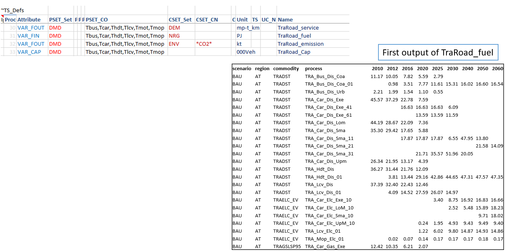

Aggregations based on Commodity names
^^^^^^^^^^^^^^^^^^^^^^^^^^^^^^^^^^^^^
**~Commodity_map** tag can be used to create commodity aggregations.

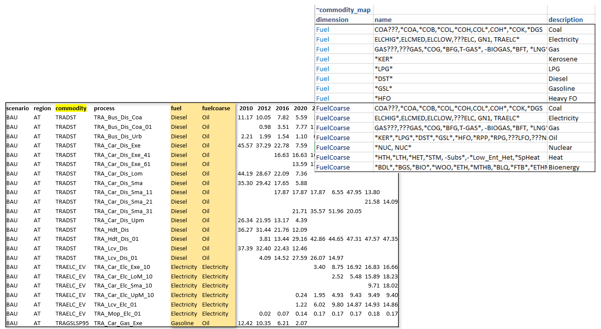

.. note::
    Like in INS tables of Veda, subsequent declarations override the previous ones. For example, you may have several different types of oil, named OILxyz. If you want to track only Oil other, Diesel and Gasoline, then write OIL* | Oil other; OILDST | Diesel; OILGSL | Gasoline, one below the other.

Aggregations based on Process names
^^^^^^^^^^^^^^^^^^^^^^^^^^^^^^^^^^^
Multiple dimensions can be extracted from process names.

.. image:: ../images/Reports/agg_on_process.png
    :width: 600

Viewing Reports
---------------
Veda2.0 has a basic report viewer, which is sufficient to validate the set up of reports and for simple visualizations. Excel export and CSV dumps are possible, like in Results.

.. image:: ../images/Reports/Veda_reports_viewer.png
    :width: 600

CSV output
^^^^^^^^^^
It can be consumed in applications like Tableau, Power BI, or LMA

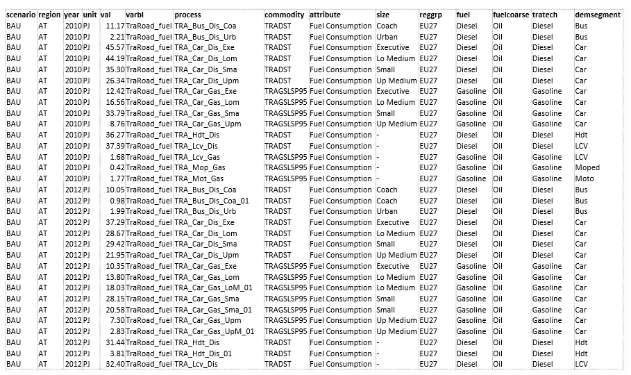

Advanced features
------------------
* By default process, commodity, and timeslice dimensions are aggregated while generating variables. TS_Defs supports a column "show_me", where one can indicate dimensions **not** to be aggregated. Dimensions are indicated by their first characters. "pct" in this column will make process, commodity, and timeslice dimensions survive.
* Sankey diagrams: Reports functionality can be used to prepare data for Sankey diagrams. See the report definitions file in JRC_EU-TIMES for one way to do this.
* Unit conversion: **~UnitConv** tag can be used to convert units. For example, EProd variables can have **PJe** as the unit, which can be converted to **Twh** in the report.
* Including exogenous data
    * Historical trends/calibration check
    * Producing per/capita and per/GDP metrics
    
* Special attributes: some ratios are computed based on naming conventions of variables. These are dynamic weighted averages.
    * Utilization factors
    * Efficiency (by DEM)
    * CO2 intensity (by DEM)

.. note::
    It is recommended that one uses "pc" in the "show_me" column when creating new variables, to check the validity of variables and aggregations. Aggregating them makes the reports lighter, so it should be done when possible.

LMA gets a lot more out of Reports
----------------------------------
LMA (Last Mile Analytics) is a proprietary web-based data visualization platform, which can be used for many different types of datasets, including results from TIMES models.
At this point, LMA is hosted on a server in KanORS office and users have to send VD files to KanORS (along with Report definitions file) to be uploaded. We are in the process
of deploying it in the cloud, and eventually users will be able to upload their reports directly from Veda2.0.
Access to LMA will not be included in the Advanced license; it will have to be arranged separately.

Sources and uses of main energy forms
^^^^^^^^^^^^^^^^^^^^^^^^^^^^^^^^^^^^^

* .. raw:: html

    <a href="https://lma.vedaviz.com/Presenter/Predex.aspx?pkp=1041&pkv=252583" target="_blank"><b>See it online </a> <i>select energy form</i></b>

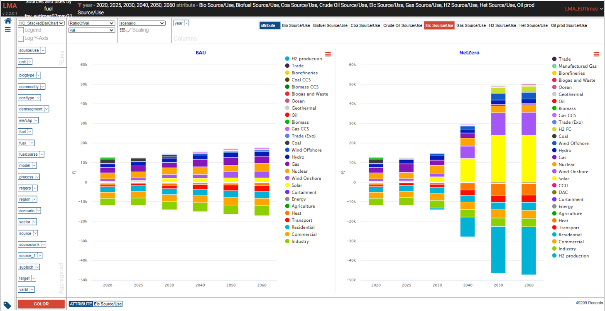

Road transport vehicles
^^^^^^^^^^^^^^^^^^^^^^^^

* .. raw:: html

    <a href="https://lma.vedaviz.com/Presenter/Predex.aspx?pkp=1041&pkv=252590" target="_blank"><b>See it online </a> <i>select region</i></b>

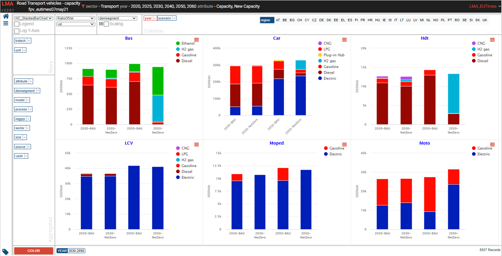

Power generation
^^^^^^^^^^^^^^^^^

* .. raw:: html

    <a href="https://lma.vedaviz.com/Presenter/Predex.aspx?pkp=1041&pkv=252586" target="_blank"><b>See it online </a> <i>select electricity/hydrogen/heat, and region</i></b>

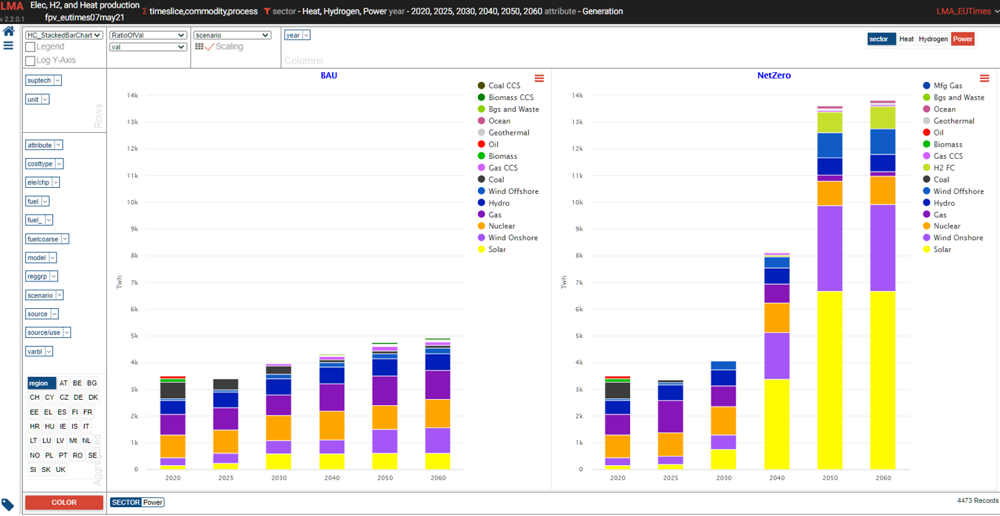

Power generation – alternate view
^^^^^^^^^^^^^^^^^^^^^^^^^^^^^^^^^

* .. raw:: html

    <a href="https://lma.vedaviz.com/Presenter/Predex.aspx?pkp=1041&pkv=252588" target="_blank"><b>See it online </a></b>

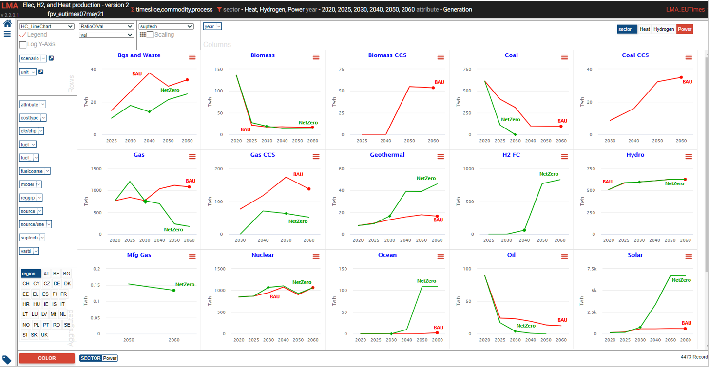

Power generation – alternate view 2
^^^^^^^^^^^^^^^^^^^^^^^^^^^^^^^^^^^

* .. raw:: html

    <a href="https://lma.vedaviz.com/Presenter/Predex.aspx?pkp=1041&pkv=252589" target="_blank"><b>See it online </a></b>

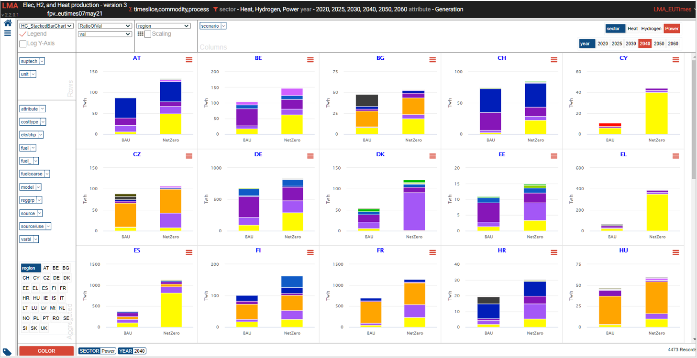

