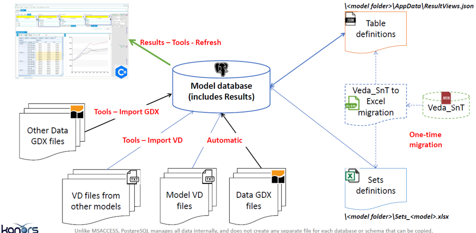
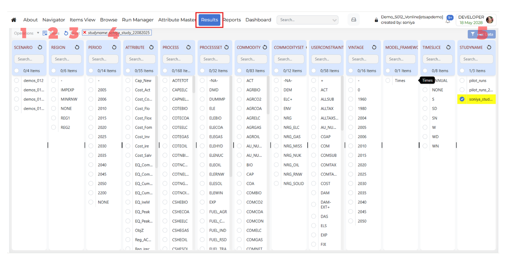

#######
Results
#######

Introduction
------------

Used to analyse TIMES model results. Results are all stored in the model folder (e.g. DemoS_012) and belongs to that model

* Model VD files: model results (VD files) are included automatically in the model database at the end of a successful run (e.g. \Veda\GAMS_WrkTIMES\DemoS_012).
* Results browsing: to view (and refresh) model results through dynamic pivot tables (cubes)
* Table definition: user defined tables for a specific model
	(<model folder>/AppData/ResultsView.json)
* Batch export: to export results in excel and CSV.

How to use it?
--------------

1. Operations
^^^^^^^^^^^^^
The **Operations** menu contains actions related to result processing and case management.

Process Results
"""""""""""""""
**Process Results** reads the **VD files** and processes all cases for the current model.

.. image:: ../images/gifs/results_process.gif
   :align: center
   :width: 600

Delete Cases
""""""""""""
Delete the saved cases in the current model.

2. Views
^^^^^^^^

.. include:: ../shared/_views_common.rst

3. Reset
^^^^^^^^

The **Reset** option clears the current result selections and removes the applied filters from the page.

4. Global Filters
^^^^^^^^^^^^^^^^^

* The **Global Filters** default applies to the latest study.
* When a row in the Results grid is **highlighted in yellow**, it means that a global filter is applied to that row.
* Press the **Ctrl key** and click on the row to apply the filter to the row.

.. image:: ../images/gifs/global_filter.gif
   :align: center
   :width: 600

5. Get Data
^^^^^^^^^^^

.. include:: ../shared/_pivot_common.rst

Right-click Functionality
^^^^^^^^^^^^^^^^^^^^^^^^^

The Results module includes right-click functionality for selected dimension items. 
This shortcut menu allows users to quickly open related actions for the selected item without changing the main Results workflow.

**Dimension-specific behavior**

The right-click menu is not the same for every dimension.

* For **PROCESS** and **COMMODITY** dimensions, the right-click menu includes the following options:
   * Items View
   * Show Detail
   * ExRes

* For ALL other dimensions, the right-click menu includes the following option:
   * Show Detail 

* **Items View**: Opens the selected item in Items View modules.
* **Show Detail**: Opens an information dialog for the selected value (for example, ``period - 2015 information`` or ``process - COTEELC information``).
* **Exes**: 

.. note::
   .. raw:: html

      <strong>Coming soon.</strong> This section will describe the <strong>Exes</strong> functionality in Results.

