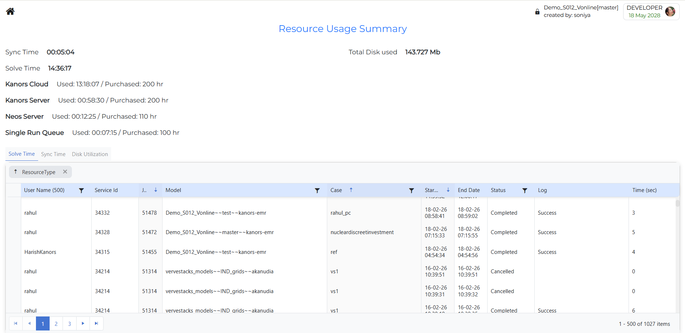

###########
Run Manager
###########

Learn RunManager with Videos - https://www.youtube.com/playlist?list=PLRCe_SRAk7hOvHdyCuLQ15-6JldaH8Ryu

Introduction
------------

* The Run Manager is used to compose and submit model runs
* Each model run is based on a Case definition comprising `Run Manager Groups <https://www.youtube.com/watch?v=tE58L8RIBFM&list=PLRCe_SRAk7hOvHdyCuLQ15-6JldaH8Ryu&index=6>`_ :

  .. image:: ../images/new_run_manager_1.PNG
    :align: center
    :width: 600px

How to use it?
--------------

1-4 Run Manager Groups
^^^^^^^^^^^^^^^^^^^^^^
The first four sections of Run Manager are:

* **1 - Scenario Groups**: Check BASE/SysSettings and the list of scenarios to be included in a "cluster" that is then given a name for inclusion later in a Case Definition for a model run.

* **2 - Region Groups**: Designation of the regions to be included in the Group definition.

* **3 - Parametric Groups**:

  .. note::
    .. raw:: html

       <strong>Coming soon.</strong> This section will be updated to describe the <strong>Parametric Groups</strong> in Veda Online.

* **4 - Property Groups**: Which GAMS switches are to be employed for the run.

Group Actions
^^^^^^^^^^^^^

The first four group sections support common actions such as creating, updating, and deleting groups.

* **New/Copy Groups** `Create/Edit/Delete Groups <https://www.youtube.com/watch?v=rKRSE-WC1Ns&list=PLRCe_SRAk7hOvHdyCuLQ15-6JldaH8Ryu&index=7>`_

  * Click **New/Copy** button.
  * Enter the required group name in the text box.
  * Click **Save** button.
  * The new group will be added to the list.

* **Update Groups**

  * Select the required saved group from the dropdown.
  * Modify the required checkboxes, selections, expandable items, or property values.
  * After making changes, the **Update Group** button appears.
  * Click **Update Group** to save the modified group.

* **Delete Groups**

  * Select the group you want to remove.
  * Click **Delete** button.
  * The selected group will be deleted.

  .. note::
    * **Delete** removes the whole group, not just individual selected items.
    * **Update Group** is used only after changing the selected items or settings for an existing group.
    * The item count helps you quickly confirm how many items are included in the selected group.
    * Depending on the section, the group may contain scenarios, regions, parametric items, or property settings.
    * Check the selected group carefully before deleting it.

5 - Settings panel
^^^^^^^^^^^^^^^^^^

.. image:: ../images/run_manager_settings_panel.PNG
  :align: center
  :width: 300px

* **Update Results and Reports**

  * This option allows you to update the results and reports for the selected case.
  * This option is not supported with **Local Run** option.

* **Email**

  * This option allows you to send an email notification when the case is solved.

* **Study Name**

  .. note::
    .. raw:: html

       <strong>Coming soon.</strong> This page will describe the <strong>Study Name</strong> in Veda Online.

* **Solve Time**

  * This section displays the available solving resources that can be used to run the case.

* **Local Run**  `Solving a Locally <https://www.youtube.com/watch?v=VUXD7J4mjqE&list=PLRCe_SRAk7hOvHdyCuLQ15-6JldaH8Ryu&index=11>`_

  * The **Local Run** option allows the user to execute the case using their local system environment, provided the required setup is available.

* **Study Collaboration with** 

  * Study Collaboration is used when a model owner wants to allow other users to view or work on a specific study. When the study is shared, the names of the users who have access to that study are displayed in the “Study collaboration with” section.

6 - Manage Saved Cases
^^^^^^^^^^^^^^^^^^^^^^
Review and manage saved case definitions, then select one or more cases to run.

* **Create New Case**

  * Create a New Case by providing the core information for the case definition

    .. image:: ../images/case_definition.png
      :align: center
      :width: 400px  

  * Case Name - name of the case
  * Description - description of the case
  * Scenario Group - scenarios to be included in this run
  * Region Group - regions to be included in this run
  * Parametric Group - driver scenario for a suite of runs
  * Properties Group - what GAMS options/switch are to be employed
  * Periods Definition - period definition for the run
  * Ending Year - last period for the run
  * Source TIMES - where does the TIMES code reside
  * Solver - which solver is to be used
  * Solver Options - which solver options to use
  * **GDX References** - GDX files to be used for freezing periods, elastic demand base prices or IRE bounds/prices

* **Delete Case**

  * Select the case you want to delete.
  * Click **Delete** button.
  * The case will be deleted.
    

* **Edit Case**

  * Double click on the case to open a summary window.
  * Modify the required information.
  * Click **Save** button. 
  * The case will be edited.
    

* **Case History**

  .. image:: ../images/Case_history.gif
      :align: center
      :width: 600px

  * When you right-click a saved case, a context option named **Case History** is shown.
  * Clicking **Case History** opens a window that shows previous execution records for the selected saved case.
  * **Group history action**: Each case history row includes an action button on the right side. Use this button to open the group history for that specific case execution.
  * **Export to Excel**: Use this option to export the case history details to an Excel file.
    

* **Model run submission/Solve Case**  `Solving a Case <https://www.youtube.com/watch?v=rBIdKZjcTtE&list=PLRCe_SRAk7hOvHdyCuLQ15-6JldaH8Ryu&index=10>`_

  .. image:: ../images/cases_grid.png
      :height: 150

  * Select one (or more) of the cases in the Managed Save Cases section and click **Solve** button.
  * Solve status of model case can be tracked in **JobsDashboard**.

7 - Resource Usage Summary
^^^^^^^^^^^^^^^^^^^^^^^^^^
* This option allows you to view the resource usage summary for the selected case.

Modifying RUN files
-------------------

There are new attributes to write TIMES switches or GAMS code at five different locations in the RUN file. Further, these declarations can also be made
at the top or bottom of scenario DD files (last two attributes in the table below). The attributes are supported by regular INS/DINS tables, in any scenario file or in SysSettings.

.. csv-table::
        :file: ../tables/times_switches/Times_switches_attr_loc.csv
        :widths: 1,1,1
        :header-rows: 1

There is no need to modify the RUN file template manually.

Commands will be ordered by Value column; only rows with value>0 will be considered.
If multiple scenarios send commands to the RUN file,
the blocks will be ordered as per the order of scenarios in the case definition.

.. note::
    This also opens up some new possibilities. For example, you can run parametric scenarios where base prices for elastic demands are picked up from different Reference cases.

These examples are available in the `Advanced Demo <https://github.com/kanors-emr/Model_Demo_Adv_Veda.git>`_ model.

.. csv-table:: Example 1
        :file: ../tables/times_switches/Example1.csv
        :widths: 20,35,15,5,50
        :header-rows: 2

If you want to use single quotes <'> in your instructions, then it is necessary to use a DINS table, as shown below. DINS tables need process or commodity specification. You can use any valid
process instead of IMPNRGZ; it will have no impact on the outcome.

.. csv-table:: Example 2
        :file: ../tables/times_switches/Example2.csv
        :widths: 20,50,30
        :header-rows: 2
