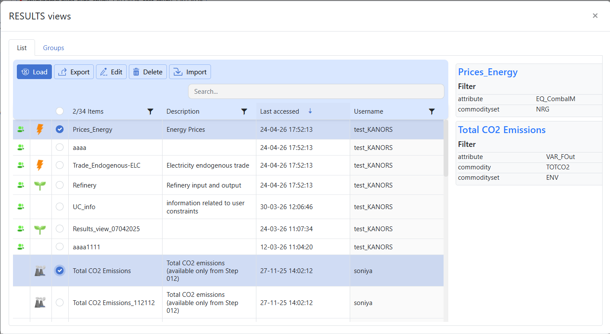

* The **Views** option is used to manage saved views.
* Use **Views** to open the **Views** window and maintain saved configurations.
* Saved views help users quickly reuse previously defined layouts, filters, and analysis settings without repeating the full setup.

* The **Views** window contains two main sections:
   #. **Views List**: shows individual saved views and lets users load, edit, export, delete, or import them.
   #. **Views Groups**: shows collections of saved views so related analyses can be organized together.

.. note::
   
   * Use **List** when you want to work on a specific saved view.
   * Use **Groups** when you want to manage related views as a collection.

* **Views List**
   The **List** tab shows the available saved views.
   From this section, users can select a saved view and perform actions such as **Load**, **Export**, **Edit**, **Delete**, and **Import**.

   * **Load**
      Use **Load** to open a previously saved view.

      * Click **Views**.
      * Stay on the **List** tab.
      * Select the required saved view.
      * Review the saved filter summary shown in the details panel.
      * Click **Load**.

   * **Export**
      Use **Export** to export a saved view for download.

      * Click **Views**.
      * Stay on the **List** tab.
      * Select the required saved view.
      * Click **Export**.
      * Choose the required download format such as **CSV**.
      * Confirm the export action.
      * The exported file will be available in the **Jobs Dashboard**.
   * **Edit**
      Use **Edit** to modify an existing saved view.
      
      * Click **Views**.
      * Stay on the **List** tab.
      * Select the required saved view.
      * Click **Edit**.
      * Change the required filters.
      * Click **Update Filters**.
      * Confirm the update.

   * **Delete**
      Use **Delete** to remove a saved view.

      * Click **Views**.
      * Stay on the **List** tab.
      * Select the required saved view.
      * Click **Delete**.
      * Confirm the deletion, if prompted.

   * **Import**
      Use **Import** to bring saved views from another model into the current model.

      * Click **Views**.
      * Stay on the **List** tab.
      * Select the required saved view.
      * Click **Import**.
      * Select the source model.
      * Review the available views.
      * Select the required view or views.
      * If needed, also select the required group of cases.
      * Confirm the import action.
      * Imported views will appear in the **Views List** with shared icon.
      * Imported groups will appear in the **Manage Cases** section of the **Run Manager**, marked with the shared icon.
 
      
* **Views Groups**
   The **Groups** tab displays saved view groups, where available.
   This section is used to organize and manage views in grouped form.

.. note::

   * The right-side details panel helps users review saved filter information before loading, editing, exporting, or deleting a view.
   * Imported views behave like regular saved views after import.
   * Export runs as a background job, and files are downloaded from the **Jobs Dashboard**.
   * Use **Edit** to update an existing saved view, and **Load** to open it without making changes.
   * A collection of saved views is called a **group**.
   * The **Groups** tab is used to view and manage groups.
   * Groups help users organize related views for easier reuse.
